# A MATHEMATICAL MODEL FOR PREDICTING FIRE SPREAD IN WILDLAND FUELS

Richard C. Rothermel

INTERMOUNTAIN FOREST AND RANGE EXPERIMENT STATION
Forest Service
U.S. Department of Agriculture
Ogden, Utah 84401
Robert W. Harris, Director


#### PREFACE

Forest managers as well as those engaged in research involving fires in forests, brush fields, and grasslands need a consistent method for predicting fire spread and intensity in these fuels. The availability of the mathematical model of fire spread presented in this paper offers for the first time a method for making quantitative evaluations of both rate of spread and fire intensity in fuels that qualify for the assumptions made on the model. Fuel and weather parameters measurable in the field are featured as inputs to the model. It is recognized that this model of the steady-state fire condition is only a beginning in modeling wildland fires, but the initial applications to the National Fire-Danger Rating System and to fuel appraisal illustrate its wide applicability.

The introduction of this model will permit the use of systems analysis techniques to be applied to land management problems. As a result, a new dimension is offered to land managers for appraising the consequences of proposed programs. Questions can be answered such as: What is the resultant fuel hazard when thinning is done in overstocked areas? Can logging practices be modified to reduce the potential fire hazard of the fuels they produce? How much slash should be left on the ground to produce the desired site treatment for the next crop of trees? How long after cutting can a successful burn still be achieved? What is the hazard buildup in chaparral brush fields of the Los Angeles Basin in years subsequent to the last burn?

Systems analysis can be applied not only to these broader aspects of vegetative manipulation activities, but also to traditional activities, such as presuppression planning and prescribed burning. As we learn more about the growth and decay patterns of our fuels, the long-range consequences of management policy can be examined and appraised on a quantitative basis. Decisions will be more often in line with the desired outcome when the alternatives to proposed practices can be compared and evaluated before a stick of wood is cut.

This mathematical model has been developed for predicting rate of spread and intensity in a continuous stratum of fuel that is contiguous to the ground. The initial growth of a forest fire occurs in the surface fuels (fuels that are supported within 6 feet or less of the ground). Under favorable

burning conditions, if sufficient heat is generated, the fire can grow vertically into the treetops causing a crown fire to develop. The nature and mechanisms of heat transfer in a crown fire are considerably different than those for a ground fire. Therefore, the model developed in this paper is not applicable to crown fires. An exception can be made for brush fields. Brush, such as chamise, is characterized by many stems and foliage that are reasonably contiguous to the ground, making it suitable for modeling as a ground fire.

Contributions to the spread of the fire by firebrands have not been included. At first this may seem to be a serious limitation to the model because everyone who has been on a large fire (most investigators go to large fires, the fires not presently being modeled) knows the importance of spotting. However, seeing firebrands in the air and landing ahead of the fire front does not mean that they are effective in advancing the fire. Berlad (1970) has shown that not all firebrands have a significant effect in spreading a fire. To be significant, firebrands must release sufficient heat when they land to ignite the adjacent fuels, and they must do so before the fire would have overrun the descent point as a result of conventional heat transfer mechanisms.

Furthermore, the model has been designed to simulate a fire that has stabilized into a quasi-steady spread condition. Most fires begin from a single source and spread outward, growing in size and assuming an elliptical shape with the major axis in the direction most favorable to spread. When the fire is large enough so that the spread of any portion is independent of influences caused by the opposite side, it can be assumed to have stabilized into a line fire. A line fire behaves like a reaction wave with progress that is steady over time in uniform fuels.

All input parameters can be determined from knowledge of the characteristics of fuels in the field. This does not imply that all the parameters of fuels and environment are readily available or can easily be measured. It does, however, delineate what parameters should be cataloged and eliminates those that are not needed. A convenient method of cataloging input parameters is through the concept of fuel models tailored to the vegetation patterns found in the field. The companion fuel models are thus a set of input parameters that describe the inherited characteristics that have been found in certain fuel types in the past. The environmental parameters of wind, slope, and expected moisture changes may be superimposed on the fuel models. This fuel model concept has already been incorporated into the National Fire-Danger Rating System (Deeming and others 1972).

The mathematical model produces quantitative values of spread and intensity that should be regarded as appraised or mean values for the given fuel and environmental conditions. The National Fire-Danger Rating System, however, will display the values on a relative scale in the form of indexes. The indexes developed from this mathematical model can be designed to predict conditions during which severe fire phenomena develop, even though the model does not include mass fire effects.

Concurrently, studies designed to confirm portions of the model through field tests have been conducted and are reported by J. K. Brown (1972).

#### THE AUTHOR

Richard C. Rothermel is a Research Engineer stationed at the Northern Forest Fire Laboratory in Missoula, Montana. He is the Research Project Leader for the Fire Physics research work unit. Rothermel received his B.S. degree in Aeronautical Engineering at the University of Washington in 1953. He served in the U.S. Air Force as a Special Weapons Aircraft Development Officer from 1953-1955. Upon his discharge, he was employed at Douglas Aircraft Company as a troubleshooter in the Armament Group. From 1957 to 1961 Rothermel was employed by the General Electric Company in their Aircraft Nuclear Propulsion Department at the National Reactor Testing Station in Idaho. In 1961, Rothermel joined the staff at the Northern Forest Fire Laboratory, where he has been engaged in research on the mechanisms of fire spread. He received his master's degree in Mechanical Engineering at the University of Colorado in Fort Collins in 1971.

#### **ABSTRACT**

The development of a mathematical model for predicting rate of fire spread and intensity applicable to a wide range of wildland fuels is presented from the conceptual stage through evaluation and demonstration of results to hypothetical fuel models. The model was developed for and is now being used as a basis for appraising fire spread and intensity in the National Fire-Danger Rating System. The initial work was done using fuel arrays composed of uniform size particles. Three fuel sizes were tested over a wide range of bulk densities. These were 0.026-inch-square cut excelsior, 1/4-inch sticks, and 1/2-inch sticks. The problem of mixed fuel sizes was then resolved by weighting the various particle sizes that compose actual fuel arrays by either surface area or loading, depending upon the feature of the fire being predicted.

The model is complete in the sense that no prior knowledge of a fuel's burning characteristics is required. All that is necessary are inputs describing the physical and chemical makeup of the fuel and the environmental conditions in which it is expected to burn. Inputs include fuel loading, fuel depth, fuel particle surface-area-to-volume ratio, fuel particle heat content, fuel particle moisture and mineral content, and the moisture content at which extinction can be expected. Environmental inputs are mean wind velocity and slope of terrain. For heterogeneous mixtures, the fuel properties are entered for each particle size. The model as originally conceived was for dead fuels in a uniform stratum contiguous to the ground, such as litter or grass. It has been found to be useful, however, for fuels ranging from pine needle litter to heavy logging slash and for California brush fields.

The concept of fuel models is introduced, wherein parameters of wildland fuels necessary for inputs to the model are categorized and tabulated. These are then used to predict fire spread and intensity; this eliminates the necessity for repeatedly measuring such parameters. The conceptual approach recognizes that fuels have inherent characteristics that are repeatable.

#### CONTENTS

| HOW FIRE SPREADS1                           |
|---------------------------------------------|
| CONCEPTION OF MATHEMATICAL MODEL            |
| Heat Required for Ignition4                 |
| Propagating Flux                            |
| Reaction Intensity                          |
| Effect of Wind and Slope                    |
| Approximate Rate of Spread Equation         |
| EVALUATION OF PARAMETERS, NO-WIND, OR SLOPE |
| Heat Sink                                   |
| Heat Source9                                |
| Experimental Design                         |
| Experimental Results                        |
| EVALUATION OF WIND AND SLOPE COEFFICIENTS   |
| Wind Coefficient                            |
| Slope Coefficient                           |
| SUMMARY OF FIRE SPREAD EQUATIONS            |
| THE FIRE SPREAD MODEL                       |
| Formulation of Fire Spread Model            |
| -                                           |
| APPLICATION TO THE FIELD                    |
| Fuel Models and Applications                |
| LITERATURE CITED40                          |

#### HOW FIRE SPREADS

Early work in fire spread research conducted by the USDA Forest Service was primarily aimed at developing relationships between burning conditions and obvious variables that would aid forest managers to cope with fire problems. Such variables as fuel moisture, fuel loading, wind velocity, relative humidity, slope, and solar aspect were all recognized as producing important effects on fire. These effects were studied and correlated to some form of fire behavior. The work was primarily done outdoors and some very good results were obtained, considering the complexities of the problem and the variability of weather, particularly wind. Much of the present day fire-danger rating, fuel classification, and other uses of fire research are based on this pioneering work.

W. R. Fons (1946) was the first to attempt to describe fire spread using a mathematical model. Fons focused his attention on the head of the fire where the fine fuels carry the fire and where there is ample oxygen to support combustion. He pointed out that sufficient heat is needed to bring the adjoining fuel to ignition temperature at the fire front. Therefore, Fons reasoned that fire spread in a fuel bed can be visualized as proceeding by a series of successive ignitions and that its rate is controlled primarily by the ignition time and the distance between particles.

Fon's early ideas have been confirmed by recent work in flame spread theory. Tarifa and Torralbo (1967) state that:

Heating of the fuel ahead of the flame as it progresses is the first and most essential process of the flame propagation mechanism. Therefore, it is very important to know the flame propagation mechanism from flame to fuel and to study the time consumed for the heating process since it may control propagation speed in many cases. Nevertheless, there is little information on these problems.

McAlevy and others 1 theorized that:

The phenomena of flame spreading over an igniting propellant surface is viewed herein as one of continuous, diffusive, gas-phase ignition; thus, the flame spreading phenomena is linked inextricably to the ignition phenomena.

<sup>&</sup>lt;sup>1</sup>Robert F. McAlevy, III, Richard S. Magee, and John A. Wrubel. Flame spreading at elevated pressures over the surface of igniting solid propellants in oxygen/inert environments. (Paper presented at spring meeting of Western States Sect. Combust. Inst., 1967.)

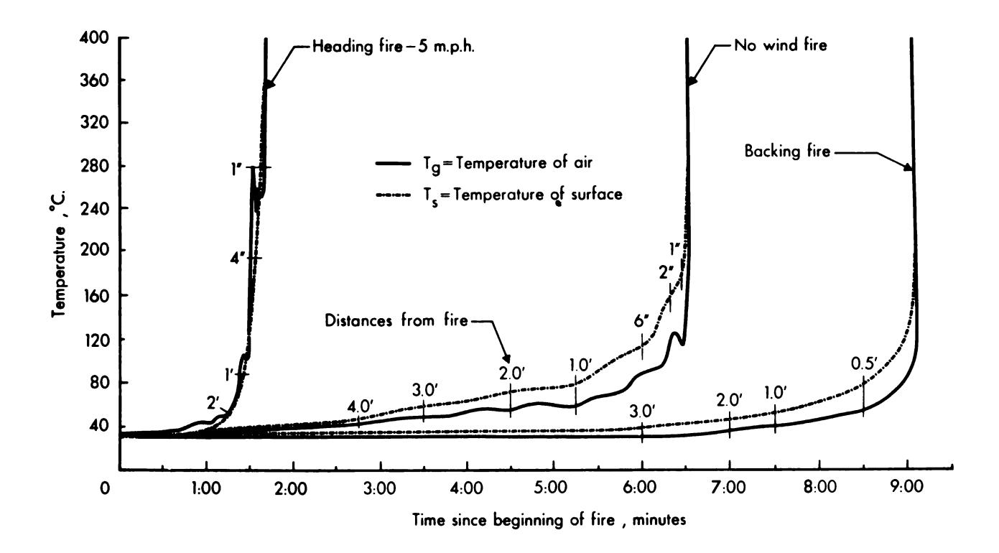

Figure 1.--Fuel temperature history prior to ignition for heading, no-wind, and backing fires.

Considering fire as a series of ignitions helps in breaking down the problem for analysis. Heat is supplied from the fire to the potential fuel, the surface is dehydrated, and further heating raises the surface temperature until the fuel begins to pyrolyze and release combustible gases. When the gas evolution rate from the potential fuel is sufficient to support combustion, the gas is ignited by the flame and the fire advances to a new position. Finally, a constant rate of spread is achieved; this is called the "quasi-steady state" wherein the fire advances at a rate that is the average of all the elemental rates.

This process is illustrated in figure 1, which is based on a laboratory test in which we monitored the surface temperature of a fine fuel element and the air adjacent to it ahead of an advancing fire. In the no-wind fire and backing fires, the fuel temperature rose slowly until the fire was within 1 or 2 inches of the fuel element where it suddenly rose to ignition. During the preheating phase, the fuel temperature exceeded the air temperature; this indicates that convective heating or direct flame contact does not occur until the fire front reaches the particle. Consequently, radiation must have accounted for the energy imparted to the fuel elements on the upper surface while simultaneously the particle was being cooled by convective indrafts. This does not occur in the heading, or wind-driven fire, in which the temperature of the fuel rose steeply even when the fire was 2 feet from the thermocouple that had been inserted in the particle. During the rise to ignition, the air temperature was higher than the fuel surface temperature; this shows that convective heating can be present in addition to radiation. Such temperature histories indicate that basic differences exist in the mechanisms that bring fuels to ignition. These basic differences provided us with a method for characterizing fires and developing similar methods for mathematical modeling.

## CONCEPTION OF MATHEMATICAL MODEL

The model was developed from a strong theoretical base to make its application as wide as possible. This base was supplied by Frandsen (1971) who applied the conservation of energy principle to a unit volume of fuel ahead of an advancing fire in a homogeneous fuel bed. His analysis led to the following:

$$R = \frac{I_{xig} + \int_{-\infty}^{0} \left(\frac{\partial I_{z}}{\partial z}\right)_{z_{c}} dx}{\rho_{be} Q_{ig}}$$
(1)

where:

R = quasi-steady rate of spread, ft./min.

 $I_{xig}$  = horizontal heat flux absorbed by a unit volume of fuel at the time of ignition, B.t.u./ft.<sup>2</sup>-min.

 $\rho_{be}$  = effective bulk density (the amount of fuel per unit volume of the fuel bed raised to ignition ahead of the advancing fire), lb./ft.<sup>3</sup>

Q<sub>ig</sub> = heat of preignition (the heat required to bring a unit weight of fuel to ignition), B.t.u./lb.

 $\left(\frac{\partial I}{\partial z}\right)^2$  = the gradient of the vertical intensity evaluated at a plane at a constant depth,  $z_c$ , of the fuel bed, B.t.u./ft.<sup>3</sup>-min.

The horizontal and vertical coordinates are x and z, respectively.

In Frandsen's analysis, the fuel-reaction zone interface is fixed and the unit volume is moving at a constant depth,  $z_c$ , from  $x = -\infty$  toward the interface at x = 0. The unit volume ignites at the interface.

In one sense, equation (1) shows that the rate of spread during the quasi-steady state is a ratio between the heat flux received from the source in the numerator and the heat required for ignition by the potential fuel in the denominator. Equation (1) contains heat flux terms for which the mechanisms of heat transfer are not known; consequently, it could not be solved analytically at this time. To solve equation (1), it was necessary to examine each term and determine experimental and analytical methods of evaluation. This required the definition of new terms that ultimately provided an approximate solution to equation (1).

#### **Heat Required for Ignition**

The heat required for ignition is dependent upon (a) ignition temperature, (b) moisture content of the fuel, and (c) amount of fuel involved in the ignition process.

The energy per unit mass required for ignition is the heat of preignition,  $Q_{ig}$ :

$$Q_{ig} = f(M_f, T_{ig}), B.t.u./lb.$$
 (2)

where:

 $M_{f}$  = ratio of fuel moisture to ovendry weight

T<sub>ig</sub> = ignition temperature.

The amount of fuel involved in the ignition process is the effective bulk density,  $\rho_{be}$ . To aid interpretation and analysis, an effective heating number is defined as the ratio of the effective bulk density to the actual bulk density.

$$\varepsilon \equiv \frac{\rho_{be}}{\rho_{b}} \quad (3)$$

The effective heating number is a dimensionless number that will be near unity for fine fuels and decrease toward zero as fuel size increases. Therefore,

$$\rho_{he} = f(bulk density, fuel size).$$
 (4)

#### **Propagating Flux**

The propagating flux is the numerator of the RHS (right-hand side) of equation (1) and has the units of heat per unit area, per unit time. The propagating flux is represented by  $I_{\rm p}$ :

$$I_{p} = I_{xig} + \int_{-\infty}^{0} \left(\frac{\partial I_{z}}{\partial z}\right)_{z} dx, B.t.u./ft.^{2-min}.$$
 (5)

The propagating flux is composed of two terms, the horizontal flux and the gradient of the vertical flux integrated from minus infinity to the fire front. These fluxes can be characterized as shown in figures 2, 3, and 4. The figures indicate that the vertical flux is more significant during wind-driven and upslope fires because the flame tilts over the potential fuel, thereby increasing radiation, but more significantly causing direct flame contact and convective heat transfer to the potential fuel.

We will assume the vertical flux is small for no-wind fires and let  $I_p = (I_p)_0$ . In the model,  $(I_p)_0$  is the basic heat flux component to which all additional effects of wind and slope are related.

When we substitute equations (3) and (5) into equation (1) and let  $I_p = (I_p)_0$  and  $R = R_0$  for the no-wind case, then

$$(I_p)_o = R_o \rho_b \epsilon Q_{ig}, B.t.u./ft.^2-min.$$
 (6)

Figure 2.--Schematic of no-wind fire.

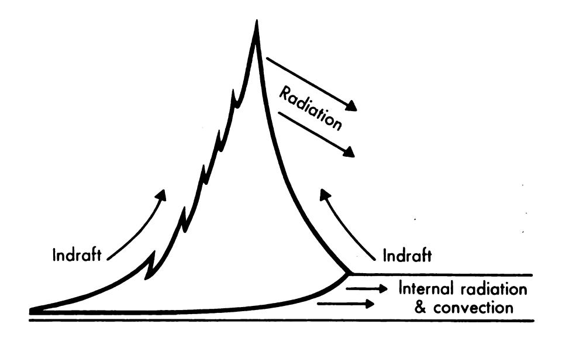

Wind

Wind

Radionion

Convection

Flame contact

Internal radiation
& convection

Figure 3.--Schematic of wind-driven fire.

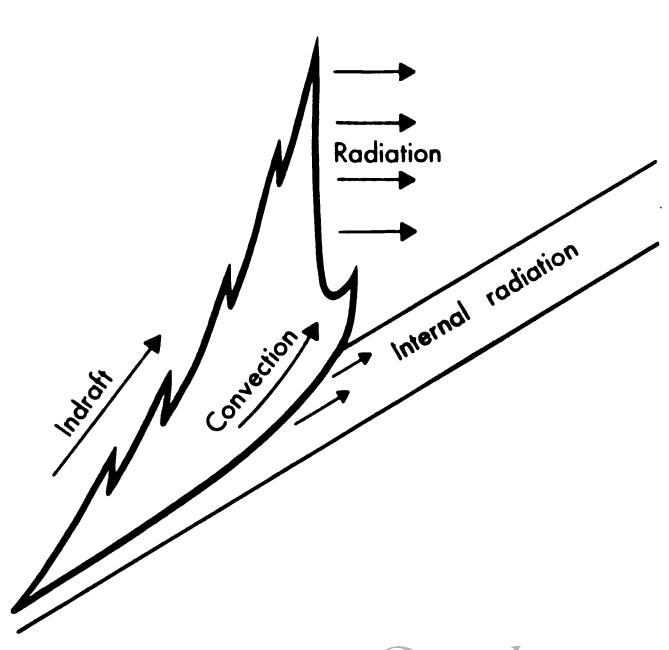

Figure 4.--Schematic of upslope fire.

Equation (6) permits  $(I_p)_0$  to be evaluated from experiments with spreading fires in the no-wind condition by measuring  $R_0$  over a wide range of fuel conditions. Note that the propagating flux occurs at the front of the fire; therefore  $(I_p)_0$  is expected to be closely related to the fire intensity of the front:

#### **Reaction Intensity**

The energy release rate of the fire front is produced by burning gases released from the organic matter in the fuels. Therefore, the rate of change of this organic matter from a solid to a gas is a good approximation of the subsequent heat release rate of the fire. The heat release rate per unit area of the front is called the reaction intensity and is defined as:

$$I_{R} = -\frac{dw}{dt} h, B.t.u./ft.^{2}-min.$$
 (7)

where:

 $\frac{dw}{dt}$  = mass loss rate per unit area in the fire front, lb./ft.<sup>2</sup>-min.

h = heat content of fuel, B.t.u./lb.

The reaction intensity is a function of such fuel parameters as the particle size, bulk density, moisture, and chemical composition.

The reaction intensity is the source of the no-wind propagating flux,  $(I_p)_o$ . An important concept upon which the model is based that  $(I_p)_o$  and  $I_R$  can be evaluated independently and correlated. Knowing the correlation,  $(I_p)_o$  can be determined from the reaction intensity, which is in turn dependent on fuel parameters obtained from the fuel bed complex.

$$(I_p)_o = f(I_R). (8)$$

If this concept is kept in mind, it will aid in understanding the development of the model.

#### **Effect of Wind and Slope**

Wind and slope change the propagating heat flux by exposing the potential fuel to additional convective and radiant heat (figs. 3 and 4).

Let  $\phi_W$  and  $\phi_S$  represent the additional propagating flux produced by wind and slope. They are dimensionless coefficients that are functions of wind, slope, and fuel parameters. They must be evaluated from experimental data. The total propagating flux is represented by the expression,

$$I_p = (I_p)_0 (1 + \phi_w + \phi_s).$$
 (9)

### Approximate Rate of Spread Equation

Inserting the approximate relationships, equation (1) becomes:

$$R = \frac{(I_p)_o (1 + \phi_w + \phi_s)}{\rho_b \varepsilon Q_{ig}}$$
 (10)

# EVALUATION OF PARAMETERS, NO-WIND, OR SLOPE

The conceived functional relationships necessary for evaluating equation (1) are divided and considered first as those forming a heat sink, and second as those serving as a heat source.

#### **Heat Sink**

Heat of Preignition

The heat of preignition and the effective bulk density are the two terms that had to be evaluated before the propagating flux could be computed.  $Q_{ig}$  was evaluated analytically for cellulosic fuels by considering the change in specific heat from ambient to ignition temperature and the latent heat of vaporization of the moisture.

$$Q_{ig} = C_{pd} \Delta T_{ig} + M_{f} (C_{pw} \Delta T_{B} + V)$$
(11)

where:

C<sub>nd</sub> = specific heat of dry wood

 $\Delta T_{ig}$  = temperature range to ignition

 $M_f$  = fuel moisture, lb. water/lb. dry wood

 $C_{pw}$  = specific heat of water

 $\Delta T_{R}$  = temperature range to boiling

V = latent heat of vaporization.

Details of the calculation are given by Frandsen.  $^2$  The temperature to ignition is assumed to range from 20° to 320° C. and boiling temperature to be at  $100^{\circ}$  C., then equation (11) becomes:

$$Q_{ig} = 250 + 1,116 M_{f}, B.t.u./lb.$$
 (12)

<sup>&</sup>lt;sup>2</sup>W. H. Frandsen. The effective heating of fuel particles ahead of a spreading fire. USDA Forest Serv., Intermountain Forest and Range Exp. Sta., Ogden, Utah (in preparation).

Figure 5.--Instrumentation for determining the effective bulk density.

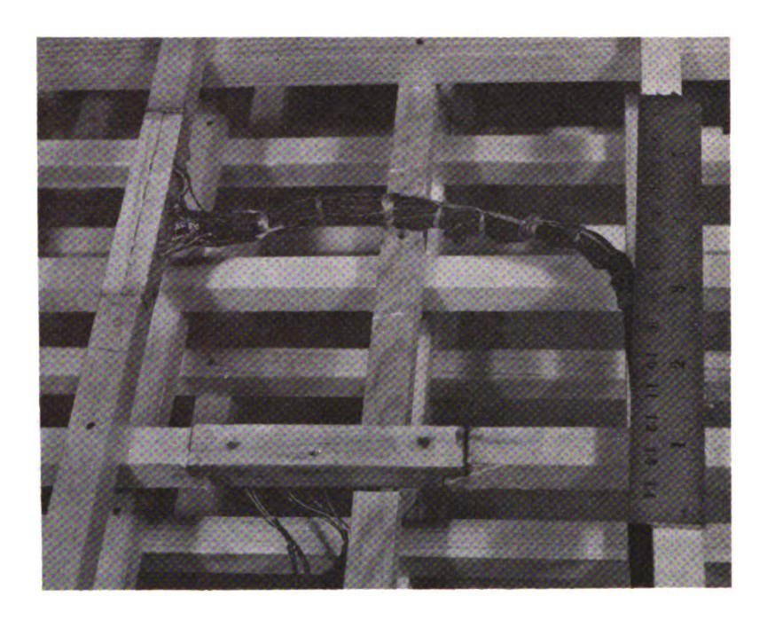

Moisture is the primary independent variable in the evaluation of  $Q_{ig}$ ; however, it is recognized that other parameters should eventually be included in this evaluation: heating rate, inorganic impurities, and nonpyrolytic volatiles.

Effective Bulk Density

To evaluate the effective bulk density ( $\rho_{be}$ ), we needed to determine the efficiency of heating as a function of particle size. This was evaluated by placing thermocouples within sections of two sticks that were located on the upper surface 3 feet from one end of standard wood cribs. The instrumented sections were oriented in both the longitudinal and lateral directions (fig. 5). The temperature distribution within the sticks was analyzed to determine the amount of heat absorbed by the sticks up to the time of ignition.

Results of the analysis are shown in figure 6. An exponential fit to the data is:

$$\varepsilon = \exp(-138/\sigma) \tag{14}$$

where:

 $\sigma$  = particle surface-area-to-volume ratio, ft.<sup>-1</sup>

If we take unity as being 100-percent heating for a hypothetical zero-thickness fuel, figure 6 shows that 22 percent of the 1/2-inch stick and 50 percent of the 1/4-inch stick must be heated to ignition; it also predicts that 92.8 percent of the excelsion is heated. This agreed with our original assumption of 100 percent for fine fuels.

<sup>&</sup>lt;sup>3</sup>Frandsen, ibid.

Figure 6.--Effective heating number versus 1/o. o is the surface-area-to-volume ratio of the particle;  $\varepsilon$  is a measure of the fraction of the potential fuel that must be raised to ignition.

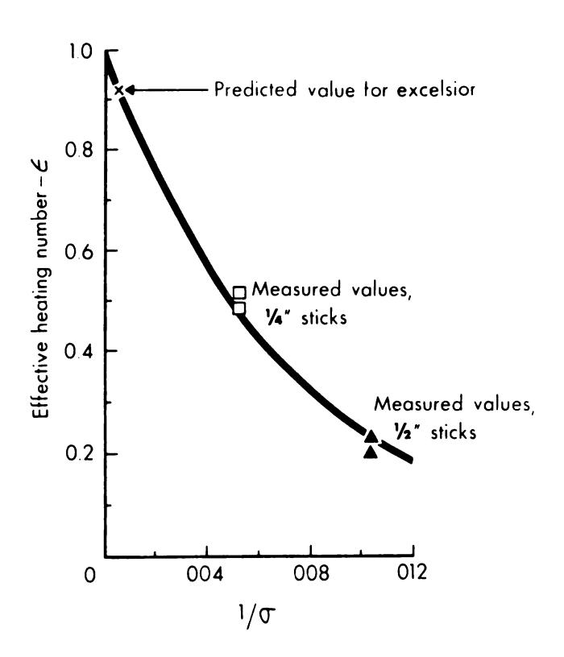

#### **Heat Source**

Reaction Intensity

The most complex function evaluated was reaction intensity using a new concept that evolved by deriving fire intensity from the weight loss data. The evaluation was made from a series of experiments utilizing an instrument system that recorded the weight of a portion of the fuel bed during fire spread.

Equation (7) can be rearranged to express reaction intensity in the following manner:

$$I_{R} = -\left(\frac{dw}{dx}\right)\left(\frac{dx}{dt}\right)h\tag{15}$$

where:

 $\frac{dx}{dt}$  = R, the quasi-steady rate of spread.

Therefore,

$$I_{R}dx = -Rh dw. (16)$$

To solve equation (16) integrate x over the reaction zone depth, D, and w over the limits of the loading in the reaction zone.

$$I_{R} \int_{0}^{D} dx = -Rh \int_{w_{n}}^{w_{r}} dw . \qquad (17)$$

<sup>&</sup>lt;sup>4</sup>W. H. Frandsen and R. C. Rothermel. Measuring the energy release rate of a spreading fire. USDA Forest Serv., Intermountain Forest and Range Exp. Station, Ogden, Utah (in preparation).

This gives

$$I_{R}D = Rh(w_{n} - w_{r}). \tag{18}$$

where:

D = reaction zone depth (front to rear), ft.

 $w_n = \text{net initial fuel loading, lb./ft.}^2$ 

w<sub>r</sub> = residue loading immediately after passage of the reaction zone, lb./ft.<sup>2</sup>

The net initial fuel loading was corrected for the presence of noncombustibles, water, and minerals.

The time taken for the fire front to travel a distance equivalent to the depth of one reaction zone is the reaction time  $\tau_{\text{D}}$ .

$$\tau_{R} = \frac{D}{R} . \tag{19}$$

Substituting the reaction time into equation (18) gives

$$I_{R} = \frac{h \left( w_{n} - w_{r} \right)}{\tau_{R}} . \tag{20}$$

We now define a maximum reaction intensity where there is no loading residue left after the reaction zone is passed and where the reaction time remains unchanged. This maximum reaction intensity is represented by

$$I_{Rmax} = \frac{hw_n}{\tau_R} . (21)$$

The reaction zone efficiency is then defined as

$$\eta_{\delta} = \frac{I_{R}}{I_{Rmax}} = \frac{(w_{n}^{-w}r)}{w_{n}}.$$
 (22)

Replacing (w\_n-w\_r) in equation (20), we have  $\mathbf{I}_R$  in terms of measurable fuel and fire parameters.

$$I_{R} = \frac{w_{n}^{h\eta}\delta}{\tau_{R}} . {23}$$

The net fuel loading necessary for equation (23) can be obtained from equation (24).

$$\mathbf{w}_{\mathbf{n}} = \frac{\mathbf{w}_{\mathbf{0}}}{1 + \mathbf{S}_{\mathbf{T}}} \tag{24}$$

where:

 $\mathbf{w}_{0}$  = ovendry fuel loading, lb./ft.<sup>2</sup>

 $S_T$  = fuel mineral content,  $\frac{1b. \text{ minerals}}{1b. \text{ dry fuel}}$ .

Reaction Velocity

The reaction velocity is a dynamic variable that indicates the completeness and rate of fuel consumption. Therefore, it represents the dynamic character of the fire and is the key to successful development of the model.

The reaction velocity is defined as the ratio of the reaction zone efficiency to the reaction time,

$$\Gamma \equiv \frac{\eta_{\delta}}{\tau_{R}}$$
 reaction velocity, min.<sup>-1</sup>. (25)

Four fuel parameters are considered to have a major effect on the reaction velocity-moisture content, mineral content, particle size, and fuel bed bulk density.

Fuel moisture and mineral content are introduced through two damping coefficients that operate on the potential reaction velocity; the latter is the reaction velocity that would exist if the fuel were free of moisture and contained minerals at the same concentration as alpha cellulose. The presence of moisture or minerals reduces the reaction velocity below its potential value.

Let:

 $\Gamma'$  = potential reaction velocity, min.-1

 $\eta_{M}$  = moisture damping coefficient having values ranging from 1 to 0, dimensionless.

 $\eta_{\rm c}$  = mineral damping coefficient having values ranging from 1 to 0, dimensionless.

Then: 
$$\Gamma = \Gamma' \eta_M \eta_S$$
 (26)

Substituting equations (25) and (26) into equation (23) produces the final expression for reaction intensity.

$$I_{R} = w_{n}h\Gamma \uparrow \eta_{M}\eta_{S} . \qquad (27)$$

The reaction velocity and the moisture and mineral damping coefficients must be evaluated by experimentation.

Moisture Damping Coefficient

The moisture damping coefficient is defined as

$$\eta_{M} = \frac{(I_{R})}{(I_{Rmax})}, \text{ at } M_{f} = 0.$$
 (28)

Anderson (1969) tested identical fuel beds of ponderosa pine needles over a wide moisture range. The ratio  $I_R/I_{Rmax}$  or  $\eta_M$ , as plotted in figure 7, was obtained from his data.

The abscissa in figure 7 is the ratio of  $M_f$ , the fuel moisture, to  $M_X$ , the moisture of extinction.  $M_X$  is the moisture content of the fuel at which the fire will not spread. For litter fuels of ponderosa pine needles,  $M_X \approx 0.30$ ; for other dead fuels,

Figure 7. -- Determination of moisture damping coefficient from ponderosa pine needle fuel beds.

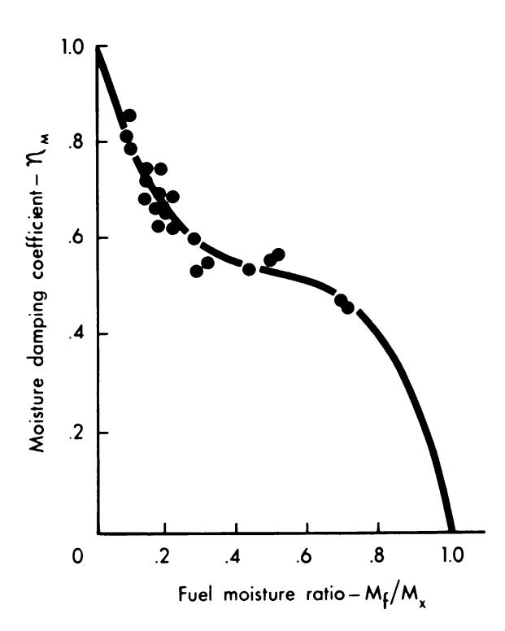

it may vary between 0.10 and 0.40.5 Recent field experiments in logging slash (Brown 1972) indicate that  $M_X$  may be between 0.10 and 0.15 for logging slash, which is more porous than litter.

The equation for the curve in figure 7 is

$$\eta_{M} = 1 - 2.59 \frac{M_{f}}{M_{x}} + 5.11 \left(\frac{M_{f}}{M_{x}}\right)^{2} - 3.52 \left(\frac{M_{f}}{M_{x}}\right)^{3}$$
 (29)

The moisture damping coefficient accounts for the decrease in intensity caused by the combustion of fuels that initially contained moisture. The exact effect of the moisture has not been adequately explained in terms of reaction kinetics.

 $Q_{\mbox{ig}}$  is included implicitly in the development of  $\eta_{\mbox{M}}.$  If further studies of  $Q_{\mbox{ig}}$  reveal it to be nonlinear, then the curve form of  $\eta_{\mbox{M}}$  will change.

Mineral Damping Coefficient

The mineral damping coefficient was evaluated from thermogravimetric analysis (TGA) data of natural fuels by Philpot (1968). In this study, it was assumed that the ratio of the normalized decomposition rate would be the same as the normalized reaction intensity. The maximum decomposition rate used for normalization was at a mineral content of 0.0001, a value that was assumed to be the lowest fractional mineral content for natural fuels. Philpot found that silica did not affect the decomposition rate. Therefore, the silica-free ash content was taken as the independent parameter. The data are shown in figure 8. The equation for the curve in figure 8 is

$$\eta_{s} = 0.174(S_{p})^{-.19} \tag{30}$$

where:  $S_e = effective mineral content (silica free).$ 

 $<sup>^{5}\</sup>mathrm{To}$  avoid confusion in equation development, the moisture and mineral values are expressed as a ratio rather than a percent.

Figure 8.--Mineral damping coefficient of natural fuels, derived from the work of Philpot (1968).

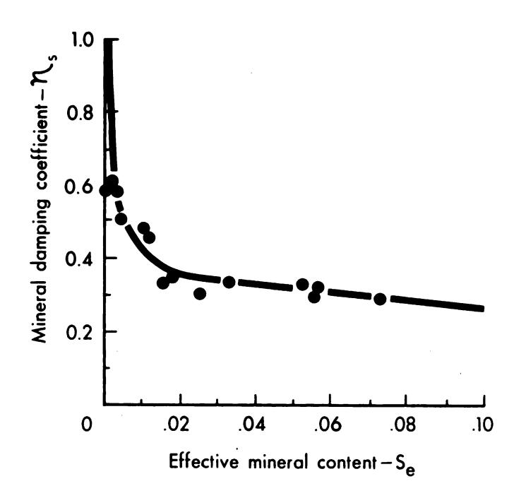

Physical Fuel Parameters

Two variables remain that had to be considered in evaluating the reaction intensity—fuel bed compactness and fuel particle size. Both are known to have significant effects upon combustibility, but to date, integrated research has not been conducted to separate and quantify the effects of these variables on the dynamic character of fire.

It is hypothesized that low values of fire intensity and rate of spread occur at the two extremes of compactness (loose and dense). In dense beds, this can be attributed to low air-to-fuel ratio and to poor penetration of the heat beyond the upper surface of the fuel array. In loose beds (at the other extreme), low intensity and poor spread are attributed to heat transfer losses between particles and to lack of fuel. Between these two extremes, therefore, there must be an optimum arrangement of fuel that will produce the best balance of air, fuel, and heat transfer for both maximum fire intensity and reaction velocity. It is not expected that the optimum arrangement will be the same for different size fuel particles.

The compactness of the fuel bed is quantified by the packing ratio, which is defined as the fraction of the fuel array volume that is occupied by fuel. The packing ratio can be easily calculated by evaluating the ratio of the fuel array bulk density to the fuel particle density,

$$\beta = \frac{\rho_b}{\rho_p} \tag{31}$$

where:

 $\beta$  = packing ratio, dimensionless

 $\rho_{\rm b}$  = fuel array bulk density, lb./ft.<sup>3</sup>

 $\rho_n$  = fuel particle density, 1b./ft.<sup>3</sup>.

The surface-area-to-volume ratio is used to quantify the fuel particle size.

Let  $\sigma$  = the fuel particle surface-area-to-volume ratio. For fuels that are long with respect to their thickness,

$$\sigma = \frac{4}{d} \cdot ft.^{-1} \tag{32}$$

where:

d = diameter of circular particles or edge length of square particles, ft.

The packing ratio of the fuel array,  $\beta$ , and the surface-area-to-volume ratio of the fuel particle,  $\sigma$ , are the primary independent variables used throughout the remainder of the paper for evaluating correlation equations.

#### Experimental Design

To evaluate the reaction velocity, a weighing platform was constructed as part of the fuel support surface for the experimental fuel beds. This weighing platform, which was 18 inches square, was supported by four load cells, which were protected from the heat by a series of baffles and ceramic cylinders. All four signals from these load cells were electronically summed, amplified, and split into two equivalent signals. One signal was recorded directly; the second was electronically differentiated before being recorded. This dual arrangement gave continuous records of the weight of the fuel on the platform as well as the time rate of change of the weight.

The excelsior fuel beds were 3 feet wide, 8 feet long, and 4-1/2 inches deep. The front of the weighing platform was placed 4 feet from the front of the fuel bed and centered laterally. This arrangement permitted the fire to reach a quasi-steady rate of spread before burning onto the platform. Inconsistencies in burning rate near the edges were minimized by allowing 9 inches of fuel on either side of the platform. Fuel cribs were constructed using 1/4-inch and 1/2-inch sticks; cribs were approximately 5 feet long, 3 feet wide, and 5 to 6 inches deep. The same size weighing platform was used for both the stick cribs and the excelsior beds.

The concept of a reaction zone and a reaction time can be visualized by considering the fuel-reaction zone interface as moving through the fuel on the weighing platform (fig. 9). When this interface reached the fuel being weighed, the strip chart recorder indicated the time of arrival by the start of weight loss. As the fire interface proceeded into the weighed fuel, the weight loss rate continued to increase. The length of the weighing platform was longer than the depth of the reaction zone; hence, the rate of weight loss stabilized when the fire advanced onto the platform a distance equivalent to the depth of the reaction zone. The lapsed time from initial weight loss to the onset of stabilization is the reaction time,  $\tau_R$ . Reaction time determination is greatly enhanced by differentiating the weight loss signal. The major conversion of woody fuels to combustible gases occurs within this time.

In figure 10, the reaction time,  $\tau_R$ , is defined on the derivative curve as the time from initial mass loss until the loss stabilizes at a steady rate. The observation of a linear mass loss rate during the reaction time was a surprising but consistent feature of our measurements. The duration of constant mass loss rate was dependent on the length of the weighing platform; it had no bearing on the duration of the reaction time.

Note also that the reaction time could be taken as the fire burned off the weighing platform. The concept of reaction time, as associated with weight loss, was first noted in this manner. However, data taken as the fire burned off the weighing platform were not as consistent as they were when it burned onto the platform.

Figure 9.--Fire-fuel interface moving through weighed fuel.

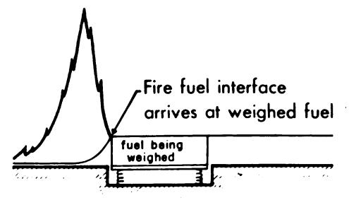

I Fire interface approaching weighed fuel

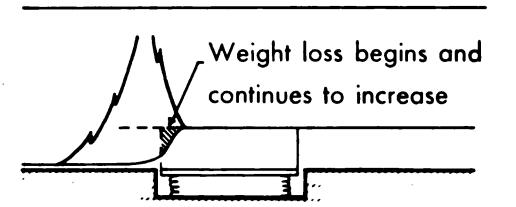

II Fire burning into weighed fuel

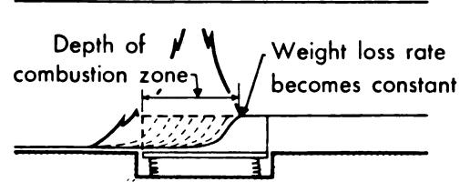

III Steady weight loss rate achieved

The mass loss rate, m, obtained from the weight loss data, was related to the following physical features:

$$\dot{m} = (w_n - w_r) RW, \qquad (33)$$

where W equals the width of the weighing platform. The efficiency of the experimental fires can now be expressed as

$$\eta_{\delta} = \frac{\hbar}{w_{n}RW}.$$
 (34)

Combining the efficiency with the reaction time,  $\tau_R$  (as indicated by equation (25) and taken from the weight loss data, figure 10), gives the experimentally determined reaction velocity,

$$\Gamma = \frac{\dot{m}}{w_{\rm n} RW \tau_{\rm R}} \tag{35}$$

The potential reaction velocity is calculated using equation (26) to disassociate the experimentally measured reaction velocity,  $\Gamma$ , from the effects of the moisture and minerals of the fuels that were used in the experiments.

$$\Gamma' = \frac{\Gamma}{\eta_{M} \eta_{S}} \tag{26}$$

The potential reaction velocity may now be correlated with the physical features of the fuel array.

Figure 10.--Illustration of mass loss and its derivative.

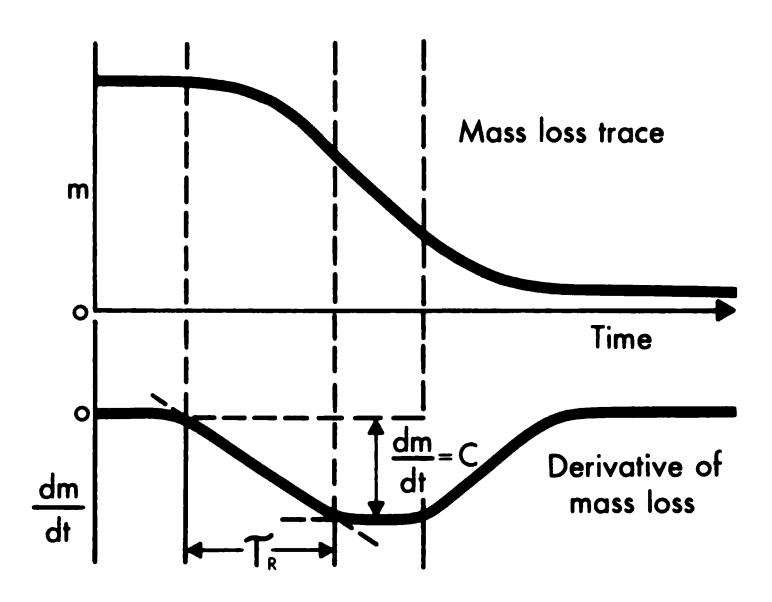

#### **Experimental Results**

Reaction Velocity

The results of the experiments utilizing the derivative of the weighing system to determine reaction velocity are shown in figure 11. As expected, there was an optimum packing ratio for each of the 1/4-inch and 1/2-inch fuels. It was not possible to identify a drop in reaction velocity at very low packing ratios with the excelsior because of (a) the difficulty in constructing a fuel bed having only a few strands of excelsior per square foot, and (b) the lack of sensitivity on the weighing system at extremely light fuel loadings. However, it is evident that the reaction velocity must drop to zero if there is no fuel to support combustion, just as it does for the larger fuels.

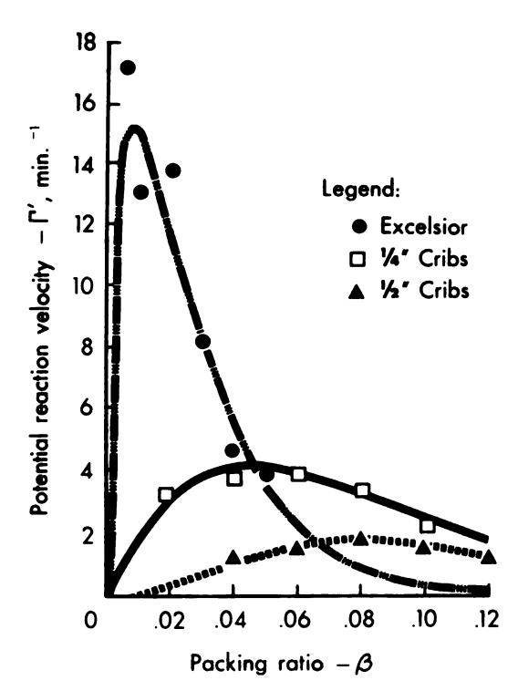

Figure 11.--Determination of correlation equation for potential reaction velocity.

Figure 12.--Determination of correlations for maximum reaction velocity and optimum packing ratio.

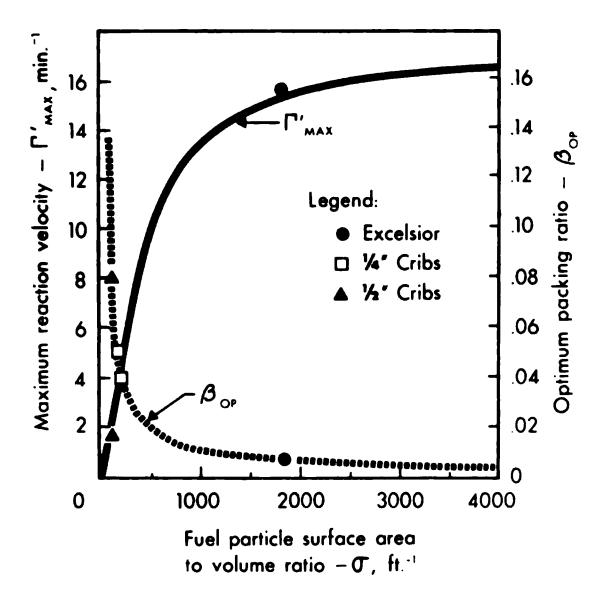

The reaction velocity for fine fuels (excelsior) is much greater near the optimum packing ratio than it is for the larger 1/4-inch and 1/2-inch sticks (fig. 11). As expected, the optimum packing ratio is not the same for all fuels and shifts to the right as the fuels increase in thickness. Note also that tightly packed fine fuels actually have lower reaction velocities than do larger fuels at the same packing ratio. The loss of reaction velocity of fine fuel can be seen in the field by observing the difference in flaming vigor between pine needles on a broken treetop supported above the ground and compacted pine needle litter; the latter burns with much less vigor.

The data points in figures 11 through 16 are the average of three or more replications in the excelsior, and two or more in the stick cribs.

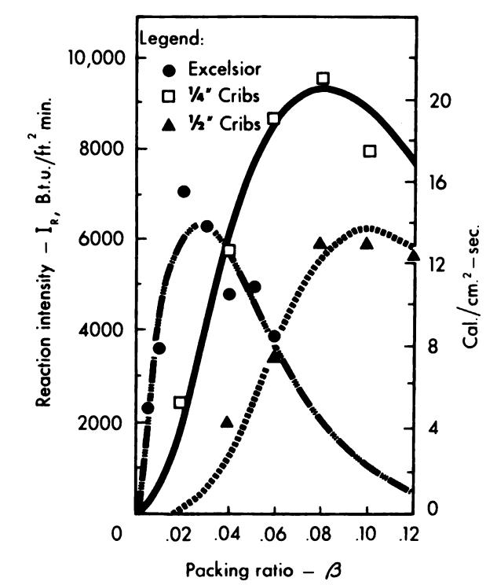

Figure 13.--Confirmation of reaction intensity equation with original data. Direct comparison of reaction intensity between fuels is not intended, nor can it be made because loading was not held constant.

Figure 14.--Determination of propagating flux ratio, ξ.

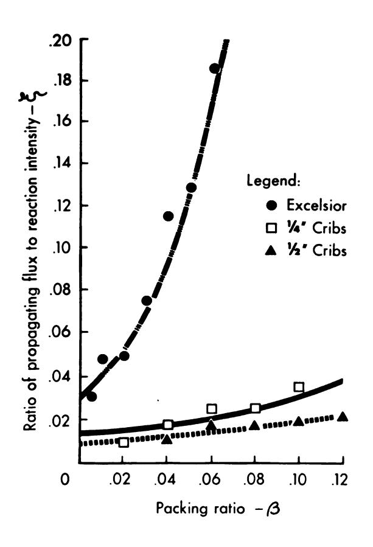

1000 Legend: Propagating flux  $-{I_p}_o$ , B.t.u./ft.²min. Excelsior □ ¼" Cribs 800 1/2" Cribs 3 600 Cal./cm.² – sec. 2 400 200 .04 .02 .06 .08 .10 .12 0 Packing ratio - B

Figure 15.--Confirmation of propagating flux equation with original data.

Figure 16.--Confirmation of rate of spread equation with original data.

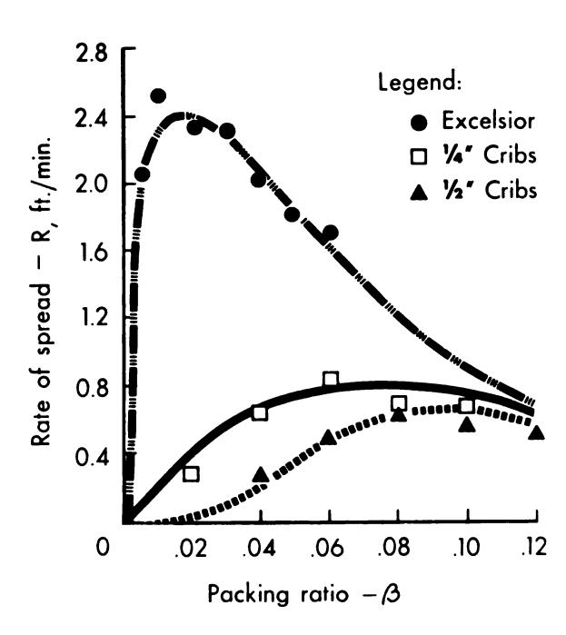

The mathematical fit to the data of figure 11 was assumed to be a modification to a Poisson distribution. To determine the general equation as a function of both  $\beta$  and  $\sigma$ , the equations for the maximum value of  $\Gamma$  and the optimum beta,  $\beta$  op, for each fuel size were found as a function of  $\sigma$  (fig. 12).

$$\Gamma'_{\text{max}} = \sigma^{1.5}/(495 + 0.0594\sigma^{1.5})$$
 (36)

$$\beta_{\rm op} = 3.348\sigma^{-0.8189}. \tag{37}$$

These were then combined with an arbitrary variable, A, to give:

$$\Gamma' = \Gamma'_{\text{max}}(\beta/\beta_{\text{op}})^{\text{A}} \exp[A(1-\beta/\beta_{\text{op}})]. \tag{38}$$

where:

$$A = 1/(4.77\sigma \cdot {}^{1}-7.27). \tag{39}$$

The equations that relate reaction velocity, reaction intensity, propagating flux, and rate of spread were developed as a set to fit not only the dependent variable but also the data shown in figures 11 through 16. Note also that equations (36), (37), (38), and (39) will predict reaction velocity for any combination of fuel particle size,  $\sigma$ , and any packing ratio,  $\beta$ . The form of the equations has been chosen to predict reasonable values when input parameters are extrapolated beyond those tested; i.e., curves do not go negative or to infinity when they obviously should not.

Reaction Intensity

The reaction intensities are calculated from equation (23) and the data obtained from the weight loss experiments are shown in figure 13.

The correlation equations that predict the reaction velocity--(36), (37), (38), and (39)--are combined with equation (27) to predict reaction intensity for the three fuel sizes used in the experiments. The curves from these equations are also plotted in figure 13, where the fit can be compared to the original data.

Direct comparison of reaction intensity between the fuels used in the experiments is not intended, nor can it be made because fuel loading was not held constant. The study data were only intended to aid in the development of equations that could be used to predict reaction intensity and, subsequently, rate of spread over a wide range of fuel and environmental combinations.

Propagating Flux

The no-wind propagating flux is calculated from equation (6),

$$(I_p)_o = R_o \rho_b \epsilon Q_{ig}. \tag{6}$$

A ratio,  $\xi$ , is now computed; it relates the propagating flux to the reaction intensity:

$$\xi = \frac{(I_p)_o}{I_p}. \tag{41}$$

The values computed for  $\xi$  are plotted in figure 14 as a function of  $\beta$  for the three fuel sizes. The following correlation equation was found for  $\xi$  as a function of  $\beta$  and  $\sigma$ :

$$\xi = (192 + 0.259\sigma)^{-1} \exp[(0.792 + 0.681\sigma^{5})(\beta + 0.1)]. \tag{42}$$

The fit of the data to this equation can be seen in figure 14.

The fit of this equation to the original values of propagating flux calculated from equation (6) can be seen in figure 15. The data show that  $(I_p)_0$  increases with increasing  $\beta$ , but at a decreasing rate. Extrapolation of equation (41) solved for  $(I_p)_0$  indicates that it would actually reach a maximum and then decrease. This is a reasonable prediction, considering the fact that the fuel array is becoming so compact that the intensity has also decreased (fig. 13).

Rate of Spread

Combining the heat source and heat sink terms produces the final no-wind rate of spread equation:

$$R_{o} = \frac{I_{R}\xi}{\rho_{b} \epsilon Q_{ig}}$$
 (43)

Predictions from this equation are shown with the original data in figure 16.

Figure 16 illustrates the difference in spread characteristics between the fine fuel, excelsior, and the sticks. A family of curves for any particle size could be calculated, using the equations developed in this section.

# EVALUATION OF WIND AND SLOPE COEFFICIENTS

To introduce wind and slope into the model, we must evaluate the coefficients  $\phi_W$  and  $\phi_S$ . Rearranging equation (9) with  $\phi_S$  = 0:

$$\phi_{\mathsf{w}} = \frac{\mathsf{I}_{\mathsf{p}}}{(\mathsf{I}_{\mathsf{p}})_{\mathsf{o}}} - 1. \tag{44}$$

If the fuel parameters in equation (6) are assumed constant, the propagating flux is proportional to the rate of spread and equation (44) becomes

$$\phi_{W} = \frac{R_{W}}{R_{Q}} - 1 \tag{45}$$

where:

 $R_{_{\!\!\! W}}$  = rate of spread in the presence of a heading wind.

Similarly,

$$\phi_{S} = \frac{R_{S}}{R_{Q}} - 1 \tag{46}$$

where:

R<sub>c</sub> = rate of spread up a slope.

For expediency it was assumed that no interaction existed between wind and slope.

#### Wind Coefficient

Rate of spread measurements in the presence of wind or on slopes in fuel arrays amenable to the no-wind model are needed to evaluate equations (45) and (46).

Wind Tunnel Experiments

Fuel beds were built using three fuel sizes at packing ratios porous enough to cause flameout and compact enough to exceed natural conditions. They were burned in the large wind tunnel at the Northern Forest Fire Laboratory. The tunnel temperatures were held between 85° and 90° F.; and the relative humidities between 20 and 25 percent. Mean tunnel velocity was set at 2, 4, 6, or 8 m.p.h. The fuel beds were 3 feet wide and 12 feet long. The excelsior fuel was 4-1/2 inches deep. The stick fuels were constructed using a new method: three sticks were stapled together near the center and spread so they stood on three legs to form a double tripod, one up and one down, joined

Figure 17.--Double tripod fuel bed used in wind tunnel experiments.

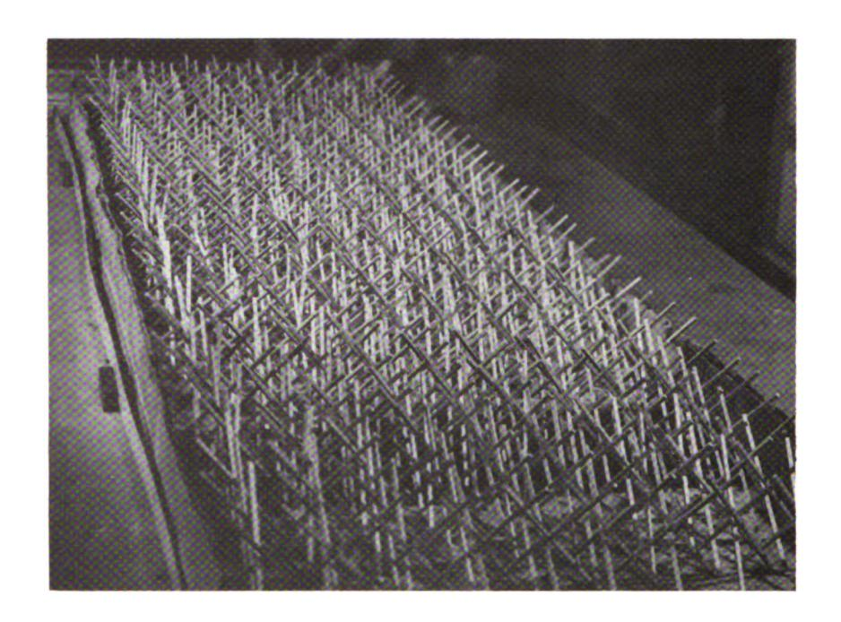

at the center. These double tripods were arranged at various spacings to achieve the desired packing ratio (figs. 17 and 18). For very low packing ratios, this arrangement is far superior to the traditional crib construction because cribs with widely spaced sticks collapse when the cross members burn out.

Excelsior fuel beds must be carefully constructed to achieve the exact fuel depth or the bulk density will be altered with drastic effects on the rate of spread.

Field Data

McArthur's (1969) data on rate of spread for heading grassland fires in Australia are shown in figure 19. However, no data are available on the particle size, depth, or loading of the various areas burned; therefore, it was assumed that these values were similar to those of a typical arid grass area in the Western United States.

 $\sigma$  = 3,500 ft.<sup>-1</sup>,  $w_0$  = 0.75 ton/acre, and depth = 1.0 ft.

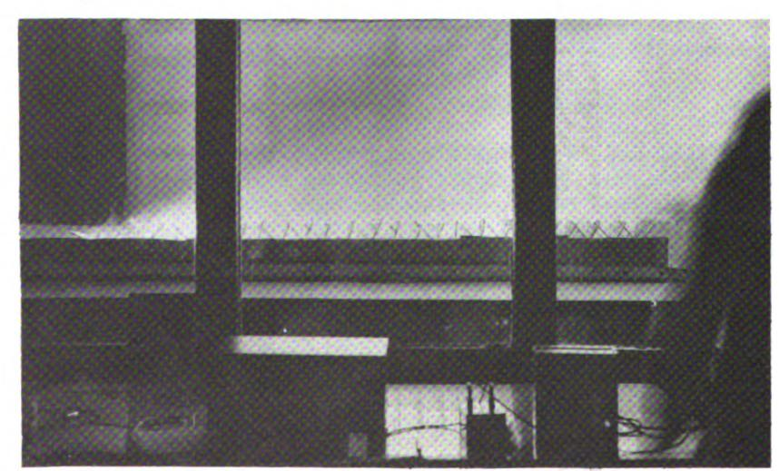

Figure 18.--Burning double tripod fuel bed in a large wind tunnel.

Figure 19. -- Reproduction of McArthur's (1969) rate of spread data for grass.

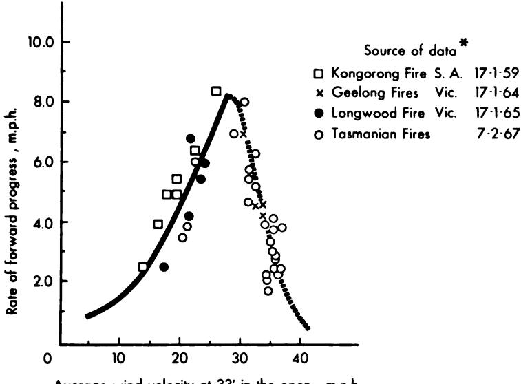

Average wind velocity at 33' in the open, m.p.h.

#### Analysis

Before a correlation could be found between wind velocity and the multiplication factor for wind, it was necessary to find an interrelationship between  $\phi_W$  and the fuel parameter,  $\sigma$  and  $\beta/\beta_{\text{op}}$ . To do this, the excelsior and 1/4-inch stick data from the wind tunnel were plotted along with McArthur's field data. Half-inch stick data did not correlate and had to be discarded. Apparently the effective bulk density is altered by the rapid heating caused by a heading fire; thus the assumption of constant fuel properties needed for obtaining equation (45) is not valid for fuels as large as one-half inch.

Another plot of the fuel parameters and multiplication factor vs. wind velocity produced the final correlation given by equation (47). Figure 20 shows the correlation parameters using the original data.

$$\phi_{\mathbf{w}} = CU^{\mathbf{B}} (\beta/\beta_{\mathbf{op}})^{-\mathbf{E}} \tag{47}$$

where:

$$C = 7.47 \exp(-0.133\sigma^{55})$$
 (48)  
 $B = 0.02526\sigma^{54}$  (49)  
 $E = 0.715 \exp(-3.59 \times 10^{-4}\sigma)$ . (50)

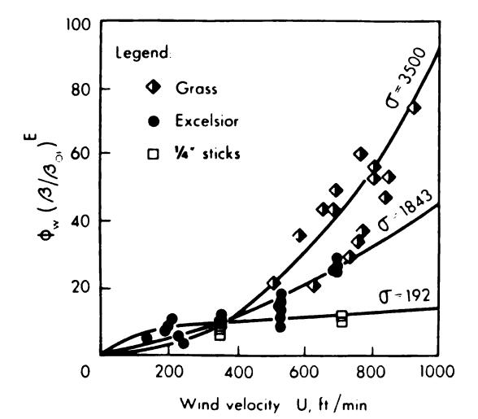

Figure 20. -- Correlation parameters for determining wind coefficient.

Digitized by Google

Figure 21.--Influence of packing ratio and particle size on wind coefficient at 12 m.p.h. In the absence of wind, the fuel conditions for best burning would occur at  $\beta/\beta_{OD}=1$ . In the presence of wind, fires spread faster in less dense fuel, i.e.,  $\beta/\beta_{OD}=$  less than 1. The wind coefficient  $\phi_W$  increases markedly as surfacearea-to-volume ratio increases.

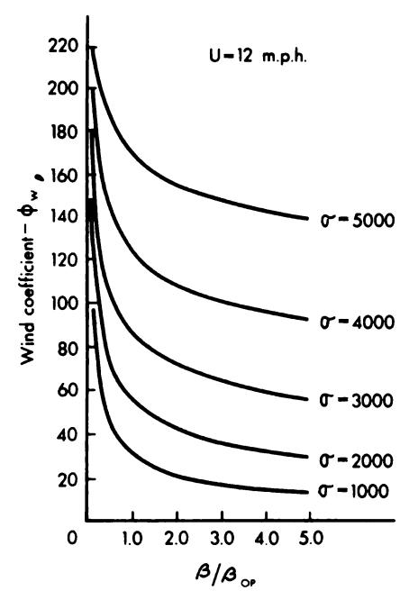

The shape of the curves is in good agreement with the concept suggested by Rothermel and Anderson (1966). At that time, it was speculated that the finer the fuel, the sharper the resulting increase in spread rate with wind velocity. As expected, fuels that were too sparse to burn well in the absence of wind will sustain a rapid fire spread when wind is applied. In effect, the optimum packing ratio shifts toward more lightly loaded fuels as wind increases. This effect is illustrated in figure 21 and can be seen in the field where sparse fuels--such as poor stands of cheatgrass--burn poorly without wind but become a flashy fuel when wind is applied.

#### **Slope Coefficient**

The effect of slope was determined for fine fuels by burning excelsior fuel beds on slopes of 25, 50, and 75 percent. The experiments were conducted in a large combustion laboratory under the same environmental conditions used for the no-wind and wind tunnel fires. Fuel was excelsior constructed at four packing ratios: 0.005, 0.01, 0.02, and 0.04. A correlation of the data is shown in figure 22. The equation for the line is

$$\phi_{s} = 5.275\beta^{-3}(\tan \phi)^{2} \tag{51}$$

where tan  $\phi$  is the slope of the fuel bed. The final form of the rate of spread equation is

$$R = \frac{I_R \xi (1 + \phi_w + \phi_s)}{\rho_b \epsilon Q_{ig}}$$

Figure 22.--Correlation parameter for slope coefficient.

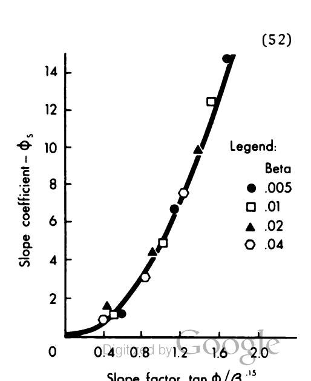

# SUMMARY OF FIRE SPREAD EQUATIONS

The complete set of parametric equations developed in this work is given on page 26. The required input parameters are given on page 27. These equations are easy to program for computer computations. Students of fire behavior can gain a perspective understanding of the effects of various input parameters by computing and crossplotting curve families for reaction velocity, reaction intensity, and other internal variables that govern fire spread. The equations might also be used for analyzing expected behavior of planned laboratory experiments. A word of caution—the fuel bed width must be sufficient to simulate a line fire (Anderson 1968); and the fuel beds must be carefully constructed to insure a uniform distribution of the fuel elements. The equations in this form have limited use in the field because few fuel types are composed of fuels that are homogeneous in size. The remainder of this paper is devoted to adaption of the parametric equations into a mathematical model suitable for field application.

Summary of Basic Fire Spread Equations

$$R = \frac{I_R \xi (1 + \phi_W + \phi_S)}{\rho_b \epsilon Q_{ig}}$$
 Rate of spread, ft./min. (52)

$$I_R = \Gamma' w_n h \eta_M \eta_S$$
 Reaction intensity, B.t.u./  
ft. 2 min. (27)

where:

$$\Gamma' = \Gamma'_{\text{max}}(\beta/\beta_{\text{op}})^{\text{A}} \exp[A(1-\beta/\beta_{\text{op}})]$$
 Optimum reaction velocity,  
 $\min_{s} -1$  (38)

$$\Gamma'_{\text{max}} = \sigma^{1.5} (495 + .0594\sigma^{1.5})^{-1}$$
 Maximum reaction velocity,(36) min.<sup>-1</sup>

$$\beta_{\text{op}} = 3.348\sigma^{-8189}$$
 Optimum packing ratio (37)

$$A = 1/(4.774\sigma^{-1} - 7.27) \tag{39}$$

$$\eta_{M} = 1 - 2.59 \frac{M_{f}}{M_{X}} + 5.11 \left(\frac{M_{f}}{M_{X}}\right)^{2} - 3.52 \left(\frac{M_{f}}{M_{X}}\right)^{3}$$

Moisture damping coefficient (29)

$$\eta_S = 0.174 \text{ Se}^{-.19}$$
 Mineral damping coefficient (30)

$$\xi = (192 + 0.2595\sigma)^{-1} \exp[(0.792 + 0.681\sigma^{-5})(\beta + 0.1)]$$
Propagating flux ratio (42)

$$\phi_{W} = CU^{B} \left(\frac{\beta}{\beta_{Op}}\right)^{-E}$$
 Wind coefficient (47)

$$C = 7.47 \exp(-0.133\sigma^{55})$$
 (48)

$$B = 0.02526\sigma.^{54} \tag{49}$$

$$E = 0.715 \exp (-3.59 \times 10^{-4} \sigma)$$
 (50)

$$W_{\rm n} = \frac{W_{\rm O}}{1 + S_{\rm T}}$$
 Net fuel loading, lb./ft<sup>2</sup> (24)

$$\phi_S = 5.275 \ \beta^{-3} (\tan \phi)^2$$
 Slope factor (51)

$$\rho_{b} = w_{o}/\delta$$
 Ovendry bulk density,  
1b./ft.<sup>3</sup> (40)

$$\varepsilon = \exp(-138/\sigma)$$
 Effective heating number (14)

$$Q_{ig} = 250 + 1,116 M_f$$
 Heat of preignition,  
 $\frac{B.t.u.}{1b.}$  (12)

$$\beta = \frac{\rho_b}{\rho_D}$$
 Packing ratio (31)

#### Input Parameters for Basic Equations

- w, ovendry fuel loading, lb./ft.2
  - $\delta$ , fuel depth, ft.
  - σ, fuel particle surface-area-to-volume ratio, 1/ft.
  - h, fuel particle low heat content, B.t.u./lb.
- $\rho_n$ , ovendry particle density, lb./ft.<sup>3</sup>
- M<sub>f</sub>, fuel particle moisture content, lb. moisture lb. ovendry wood
- S<sub>T</sub>, fuel particle total mineral content, 1b. minerals

  1b. ovendry wood
- S<sub>e</sub>, fuel particle effective mineral content, <u>lb. silica-free minerals</u> <u>lb. ovendry wood</u>
  - U, wind velocity at midflame height, ft./min.
- tan  $\phi$ , slope, vertical rise/horizontal distance
  - $^{M}_{x}$ , moisture content of extinction. This term needs experimental determination. We are presently using 0.30, the fiber saturation point of many dead fuels. For aerial fuels ( $\beta$  <.02) with low wind velocity (<5 m.p.h.)  $^{M}_{x} \simeq 0.15$ .

#### THE FIRE SPREAD MODEL

Rate of spread and intensity predicted by the model are based on equations (52) and (27). These equations had to be modified,however, to accept fuels that were composed of heterogeneous mixtures of fuel types and particle sizes. Such fuels as pine needle litter, grass, brush, and logging slash are the easiest to model. Patchy fuels--accumulations of broken branches, treetops, snags, foliage litter, brush, and other lesser vegetation are more difficult to model because of the discontinuous patterns in which they are found. For the model, however, these various size fuels are assumed to be uniformly distributed within the fuel array. This assumption is especially critical for the fine fuels (foliage and twigs under 1/4 inch in diameter).

It is also assumed that the fuel can be grouped into categories according to similar properties. For example, there would be one category for living fuel and a second for dead fuel. It is also desirable to have separate categories for foliage and branchwood. Grouping by species is not sufficient because foliage and branchwood can have significant differences in particle properties. A further breakdown by size class is required within these categories if the fuel particles vary greatly in size. The size classes used can be arbitrarily established but should include a class for fine fuels. Experience will show to what extent size class breakdowns are necessary. Our initial work indicates that the larger fuels have a negligible effect on fire spread; thus, these can often be eliminated from consideration.

To aid in the understanding of fuel distribution, we introduced the concept of a unit fuel cell. A unit fuel cell is the smallest volume of fuel within a stratum of mean depth that has sufficient fuel to be statistically representative of the fuel in the entire fuel complex. This concept permits the mathematical representation of the fuel distribution to be referenced to a unit fuel cell rather than to the entire complex.

Primarily, this concept aids in mathematically weighting input parameters. Consequently, it is not necessary to specify the size of the unit fuel cell within an area under study; rather to provide mean values per unit fuel cell which then represent the fuel complex that is being modeled. Representative inputs can be preselected to form fuel models that are tailored for analysis by the fire spread model.

The model is based on the concept that a singular characteristic parameter can be found by properly weighting the variations in the parameter in the heterogeneous mixture. To implement this concept, we had to consider how each fuel parameter in the model exerts its effect on the three characteristic features of a spreading fire: (1) The energy source; (2) the energy sink; (3) the flow of air or of heat within the array.

The processes that control combustion rate--evaporation of moisture from the fuel, transfer of heat into the fuel, and evolution of combustible gases by the fuel--occur through the surface of the fuel particle. The fuels having the highest surface-area-to-volume ratio (fine fuels) will respond the fastest; therefore, these will be involved in the leading portions of a fire. It is no revelation to firefighters or to fire scientists that fine fuels might be expected to react the fastest. However, it is not realistic to arbitrarily state that 90 percent of particles 1/8 inch in diameter and under are consumed and that some fixed ratio of the other size classes is consumed. Weighting by surface area eliminates the problem of making arbitrary decisions as to which fuel sizes to include and which not to include.

```
Mathematical Fire Spread Model Inputs
Mean values within ith category and jth size class of fuel complex:
  (\overline{w}_0)_{i,j} = ovendry loading, lb./ft.<sup>2</sup>
    (\overline{\sigma})_{ij} = surface-area-to-volume ratio, (ft.^2/ft.^3)
  (\overline{S}_T)_{i,j} = mineral content, (lb. minerals/lb. wood)
  (\overline{S_e})_{ij} = effective mineral content \frac{(lb. minerals - lb. silica)}{lb. wood}
    (\overline{h})_{i,j} = 1ow heat value, B.t.u./lb.
   (\overline{M}_f)_{ij} = \text{moisture content}, (lb. moisture)/(lb.wood)
   (\overline{\rho}_{\rm p})_{\rm i,i} = ovendry particle density, (lb./ft.<sup>3</sup>).
Mean value within ith category:
   (M_X)_i = moisture content of extinction (lb. moisture)/(lb. ovendry wood).
Mean fuel array properties:
       \overline{\delta} = depth of fuel, (ft.)
  tan \phi = slope, (ft. vertical rise/ ft. horizontal).
       U = wind velocity at midflame height, (ft./min.)
       m = total number of categories
       n = number of size classes within i<sup>th</sup> category.
```

#### Formulation of Fire Spread Model

The model is now formulated from the basic equations of fire spread and the weighting concept. The basic equations are available on page 26. The detailed weighting concept must be developed.

Weighting parameters based on the surface area of the fuel within each size class and category are developed from input parameters as shown on page 29.

Let:

 $\overline{A}_{T}$  = mean total surface area of fuel per unit fuel cell.

 $\overline{A}_{i}$  = mean total surface area of fuel of i<sup>th</sup> category per unit fuel cell.

 $\overline{A}_{ij}$  = mean total surface area of fuel of j<sup>th</sup> class and i<sup>th</sup> category per unit fuel cell.

The mean total surface area per unit fuel cell of each size class within each category is determined from the mean loading of that size class and its surface-area-to-volume ratio and particle density.

$$\overline{A}_{ij} = \frac{(\overline{\sigma})_{ij}^{(\overline{\phi}_{0})_{ij}}}{(\overline{\rho}_{p})_{ij}}$$
 (53)

The mean total surface area of the i<sup>th</sup> category per unit fuel cell and the mean total surface area per unit fuel cell are then obtained by summation of the areas within each category and within the fuel cell with equations (54) and (55),

$$\overline{A}_{i} = \sum_{\substack{i=1\\j=1}}^{j=n} (54)$$

$$\overline{A}_{T} = \sum_{i=1}^{i=m}$$

$$i = 1$$
(55)

Two weighting parameters are now calculated that are used throughout the remainder of the model:

$$f_{ij} = \frac{\overline{A}_{ij}}{\overline{A}_{i}}$$
Ratio of surface area of j<sup>th</sup>
size class to total surface area
of i<sup>th</sup> category per unit fuel cell (56)

$$f_i = \frac{\overline{A}_i}{A_T}$$
 Ratio of surface area of i<sup>th</sup> category to total surface area per unit fuel cell (57)

Using the weighting parameters, the basic fire spread equations are modified as follows:

Reaction intensity becomes:

$$I_{R} = \Gamma \sum_{i=1}^{i=m} f_{i}(\tilde{w}_{n})_{i} \tilde{h}_{i}(\tilde{\eta}_{s})_{i}(\tilde{\eta}_{M})_{i}$$
(58)

where the characteristic parameters weighted by surface area are:

$$(\tilde{w}_n)_i = \sum_{j=1}^{j=n} f_{ij}(\overline{w}_n)_{ij}$$
 Net loading of i<sup>th</sup> category (59)

$$(\overline{w}_n)_{ij} = \frac{(\overline{w}_o)_{ij}}{1 + (\overline{S}_T)_{ij}}$$
 Net loading of j<sup>th</sup> class within i<sup>th</sup> category (60)

$$\tilde{h}_{i} = \sum_{j=0}^{j=n} f_{ij} \overline{h}_{ij}$$
Low heat content value of i<sup>th</sup>
category (61)

$$(\tilde{\eta}_s)_i = 0.174(\tilde{S}_e)_i^{-.19}$$
 Mineral damping coefficient of ith category (62)

$$(\tilde{S}_{e})_{i} = \sum_{j=1}^{j=n} f_{ij}(\overline{S}_{e})_{ij}$$
Characteristic effective mineral coefficient of i category (63)

$$(\tilde{\eta}_{M})_{i} = 1 - 2.59(\tilde{r}_{M})_{i} + 5.11(\tilde{r}_{M})_{i}^{2} - 3.52(\tilde{r}_{M})_{i}^{3}$$

Moisture damping coefficient of i<sup>th</sup> category (64)

$$(\tilde{r}_{M})_{i} = \frac{(\tilde{M}_{f})_{i}}{(M_{ext})_{i}}$$
 Moisture ratio of i<sup>th</sup> category (65)

$$(\widetilde{M}_{f})_{i} = \sum_{j=1}^{j=n} f_{ij} (\overline{M}_{f})_{ij}$$
 Moisture content of ith category (66)

To complete the calculation of the reaction intensity, the potential reaction velocity,  $\Gamma'$ , must be calculated. A single value of reaction velocity is calculated for the fuel complex.

 $\Gamma$  is dependent on the packing ratio and fuel particle size. The packing ratio regulates the heat and airflow within the fuel array. This regulation of flow is dependent upon whether or not the space is occupied or vacant. Therefore the ratio should be entered as a mean value of all particle sizes. However, the surface-areato-volume ratio is a parameter that characterizes the particle size of the fuel complex that is regulating the combustion processes in the fire front and  $\sigma$  must be weighted by surface area.

Applying these concepts,

$$\Gamma' = \Gamma'_{\text{max}}(\overline{\beta}/\overline{\beta}_{\text{op}})^{\text{A}} \exp[A(1 - \overline{\beta}/\overline{\beta}_{\text{op}})]$$
 (67)

$$\Gamma'_{\text{max}} = (\tilde{\sigma})^{1.5}/(495 + 0.0594 (\tilde{\sigma})^{1.5})$$
 (68)

$$\overline{\beta}_{\text{op}} = 3.348 \ (\tilde{\sigma})^{-0.8189}$$
 (69)

$$A = (4.774 (\tilde{\sigma})^{0} \cdot 1 - 7.27)^{-1}$$
 (70)

where:

$$\tilde{\sigma} = \sum_{i=1}^{i=m} f_i \tilde{\sigma}_i$$

$$i=1$$
Characteristic surface-areato-volume ratio of the fuel complex (71)

$$\tilde{\sigma}_{i} = \sum_{j=1}^{j=n} f_{ij} \tilde{\sigma}_{ij}$$
Characteristic surface-areato-volume ratio of i<sup>th</sup> fuel category (72)

$$\overline{\beta} = \frac{1}{\delta} \sum_{i=1}^{i=m} \sum_{j=1}^{j=n} \frac{(\overline{w}_0)_{ij}}{(\overline{\rho}_p)_{ij}}$$
 Mean packing ratio (73)

$$\frac{-}{\rho_b} = \frac{1}{\frac{1}{6}} \sum_{i=1}^{i=m} \sum_{j=1}^{j=n} (\overline{w}_0)_{ij}$$
 Mean bulk density (74)

This completes the computations necessary for calculating reaction intensity.

The parameters within the basic rate of spread equation

$$R = \frac{I_R \xi (1 + \phi_W + \phi_S)}{\rho_h \epsilon Q_{i,\sigma}}, \qquad (75)$$

are treated similarly.

The no-wind propagating flux ratio, ξ, is a function of the mean packing ratio and characteristic surface-area-to-volume ratio.

$$\xi = (192 + 0.2595 \ \tilde{\sigma})^{-1} \exp[(0.792 + 0.681 \ \tilde{\sigma}^{*5})(\overline{\beta} + 0.1)]. \tag{76}$$

In the heat sink terms, the bulk density is dependent upon bulk properties of the array: The effective heating number,  $\epsilon$ , and the heat of preignition are dependent upon fuel surface. Therefore, the bulk properties must be separated from the particle properties when summing and weighting.

$$\rho_{b} \epsilon Q_{ig} = \overline{\rho}_{b} \sum_{i=1}^{i=m} f_{i} \sum_{j=1}^{j=n} f_{ij} \left[ \exp\left(\frac{-138}{\overline{\sigma}_{ij}}\right) \right] \left( \overline{Q}_{ig} \right)_{ij}$$
(77)

where:

$$(\overline{Q}_{ig})_{ij} = 250 + 1,116 (\overline{M}_{f})_{ij}$$
The heat of preignition for jth size class within the ith category (78)

The model is completed by inclusion of the wind and slope multiplication factors:

$$\phi_{\mathbf{w}} = CU^{\mathbf{B}} (\overline{\beta}/\overline{\beta}_{\mathbf{op}})^{-\mathbf{E}} \tag{79}$$

and: 
$$\phi_s = 5.275 \ (\overline{\beta})^{-0} \cdot 3 (\tan \phi)^2$$
 (80)

where:

$$C = 7.47 \exp(-.133 \ \tilde{\sigma}^{*55})$$
 (82)

$$B = 0.02526 \ \tilde{\sigma}^{.54} \tag{83}$$

$$E = 0.715 \exp(-3.59 \times 10^{-4}\tilde{\sigma}).$$
 (84)

If  $\tilde{\sigma}$  < 175, the weighted fuel size is too large for the wind factor. ( $\sigma$  decreases as fuel size increases.) We have not found this limitation to be restrictive on any of the fuel models tested to date. The reason, of course, is that wildland fuels are composed primarily of fine fuels with consequent large values of  $\overline{\sigma}$ .

An upper limit is placed on the wind multiplication factor. Rothermel and Anderson (1966) found that the angle of flame tilt could be correlated to a ratio of the energy of the wind and the energy of the fire:

$$\frac{qU}{I_RJ}$$

where:

q = free stream dynamic pressure 1b./ft.<sup>2</sup>

J = 778 ft. lb./B.t.u. - mechanical equivalent of heat

Evaluating this ratio at the limiting value of spread rate found by McArthur (1969) (fig. 20) gives:

$$\frac{qU}{I_pJ} = 3.2 \times 10^{-4}. \tag{85}$$

Assuming air temperature and density for a nominal summer day,  $T = 80^{\circ}$  F., elevation = 3,000 ft.; this reduces to,

$$\frac{U}{I_R} = 0.9. \tag{86}$$

This limit is taken for  $(\phi_w)_{max}$ .

If 
$$\frac{U}{I_R} > 0.9$$
, then  $\phi_w = \phi_w$  at  $U = 0.9 I_R$ . (87)

#### APPLICATION TO THE FIELD

The mathematical model has application to management problems in two situations:

- 1. The "hypothetical fire" situation in which operations' research techniques are utilized for fire planning, fire training, and fuel appraisal.
- 2. The "possible fire" situation for which advance planning is needed, such as fire-danger rating and presuppression planning. Predictions of potential fire severity for possible management practices (i.e., methods of thinning, slash treatment, and prescribed burning) have the potential for being the most valuable contribution that fire modeling can perform.

A third situation--forecasting the behavior of existing wildfires--will require a greater degree of sophistication than this model and our knowledge of fuels will permit at the present time. Variations in fuel and weather cause departures from predicted spread and intensity that pose risks unacceptable in fire suppression activities. A method for forecasting the behavior of a specific fire eventually will be developed; most likely, it will be patterned on a probability basis similar to that used for forecasting weather. To accomplish this, a technique must be developed for rapidly updating fuel inventories on the threatened site.

Choosing input parameters for the model from the infinite variety of fuel and environmental arrangements and combinations seems almost overwhelming. However, patterns in the growth of vegetation exist that can be utilized to greatly simplify the inventory process. It also proves helpful to group the inputs in the following manner:

1. Fuel Particle Properties

Heat Content Mineral Content Particle Density

2. Fuel Array Arrangement

Loading by Size Class--Living and Dead Mean Size Within Each Class--Surface-Area-To-Volume Ratio Mean Depth of Fuel

3. Environmental Related Values

Wind Velocity
Fuel Moisture Content
Slope

The fuel particle properties are not expected to vary greatly within vegetation types. Such values can be readily determined in the laboratory and assembled in a manner that should have wide applicability.

Fuel array arrangement patterns must be determined in the field. These inventory tasks will be more difficult than measuring fuel particle properties. However, it is expected that patterns will be found that are repeatable within the limits necessary for calculating potential fire hazard using the model. The fuel type, age of stand, exposure, soils, rainfall patterns, and fire history may be used as indexes for cataloging fuel arrangement patterns. Broader classification by ecotype or habitat will also prove valuable for sorting out fuel parameters.

The environmental related parameters can be inserted to investigate the effect of the range of wind, moisture, or slope that might be expected to be imposed upon the fuels being modeled.

#### **Fuel Models and Application**

On-the-spot sampling of all input parameters is costly, time consuming, and tedious. Cataloging fuel properties and relating them to observable site characteristics does not eliminate the fuel sampling process, but it will permit a wide application of sampling results. These results can be further refined for use in the mathematical model by assembling them into fuel models that represent typical field situations. Such fuel models contain a complete set of inputs for the mathematical fire spread model.

Land managers can be trained to choose the fuel model that is most applicable to the fuels and climate for their areas of interest. If further refinement is desired, internal properties (e.g., fuel loading in logging slash, the ratio of dead-to-living fuel in brush, and the amount and type of understory in timber) of each fuel model could be tailored to permit the model to more closely match specific fuels.

Work has already begun on fuel models for the National Fire-Danger Rating System. Eleven fuel models (table 1) have been assembled that represent a large portion of the forests, brush fields, and grasslands found in the temperate climates of North America.

The variations in spread and intensity between fuel types as predicted by the model may readily be seen from results obtained from computations with the 11 fuel models as inputs. To assist in understanding the sensitivity of the inputs, the fuel particle properties have been held constant and the variations among fuel types may be attributed to the loading by size class and fuel depth as shown in table 1. The fine fuel of the living fuel category is all that is assumed to enter into the reaction. To obtain reasonable values of reaction intensity for fuel models that contain living fuels, the moisture of extinction value for the living fuel must be adjusted to a higher value than that used for the dead fuels. Very little research has been done on the burning of living fuels. Philpot and Mutch (1971) suggest that crowning potential in ponderosa pine and Douglas-fir forests of Montana may be dependent upon the higher content of ether extractives (waxes, terpenes, and oils) that do not require pyrolysis for producing the combustible constituents. It also appears that the proportion of dead fuels within a fuel complex has an influence on how much of the living fuel burns. Fosberg and Schroeder (1971) provide a formulation for predicting the moisture of extinction of living fuels based on the ratio of living-to-dead fuels and the moisture content of the find dead fuel.

$$(M_X)_{1iving} = 2.9 \left(\frac{1-\alpha}{\alpha}\right) \left[1-\frac{10}{3} \left(M_f\right)_{dead}\right] - 0.226$$
, with a lower limit of 0.30, (88)

where:  $\alpha$  = ratio of mass-of-fine-live-fuel to mass-of-total-fine-fuel; fine fuel is taken as fuel <1/4-inch diameter.  $(M_f)_{dead}$  = moisture content (fraction, not percent) of fine dead fuel.

Table 1.--Values for input parameters of 11 preliminary fuel models for the National Fire-Danger Rating System

|                                |           |       |              | Dead fuel | el                       |       |                     |             |             |       |
|--------------------------------|-----------|-------|--------------|-----------|--------------------------|-------|---------------------|-------------|-------------|-------|
| Fue 1                          | Total     | Fine  | e.           | Med       | Medium                   | Large | <b>e</b>            | Living fuel | fuel        | Fuel  |
| types                          | loading   | р     | WO           | р         | ΨO                       | р     | ο <sub>M</sub>      | ъ           | δ           | depth |
|                                | Tons/acre | Ft1   | Lb./<br>ft.2 | Ft1       | Lb./<br>ft. <sup>2</sup> | Ft1   | $\frac{Lb.}{ft.^2}$ | Ft1         | $Lb./ft.^2$ | Ft.   |
| Grass (short)                  | 0.75      | 3,500 | 0.034        | :         | !                        | ;     | ;                   | ;           | ;           | 1.0   |
| Grass (tall)                   | 3.0       | 1,500 | .138         | ;         | 1                        | ;     | :                   | !           | ;           | 2.5   |
| Brush (not chaparral)          | 0.9       | 2,000 | .046         | 109       | 0.023                    | 1     | :                   | 1,500       | 0.092       | 2.0   |
| Chaparral                      | 25.0      | 2,000 | .230         | 109       | .184                     | 30    | .092                | 1,500       | .230        | 0.9   |
| Timber (grass and understory)  | 4.0       | 3,000 | .092         | 109       | .046                     | 30    | .023                | 1,500       | .023        | 1.5   |
| Timber (litter)                | 15.0      | 2,000 | 690.         | 109       | .046                     | 30    | .115                | !           | ;           | 0.2   |
| Timber (litter and understory) | 30.0      | 2,000 | .138         | 109       | .092                     | 30    | . 230               | 1,500       | .092        | 1.0   |
| Hardwood (litter)              | 15.0      | 2,500 | .134         | 109       | .019                     | 30    | .007                | ;           | ;           | 0.2   |
| Logging slash (light)          | 40.0      | 1,500 | 690.         | 109       | .207                     | 30    | .253                | ;           | ;           | 1.0   |
| Logging slash (medium)         | 120.0     | 1,500 | .184         | 109       | .644                     | 30    | . 759               | ;           | :           | 2.3   |
| Logging slash (heavy)          | 200.0     | 1,500 | .322         | 109       | 1.058                    | 30    | 1.288               |             | i<br>i      | 3.0   |

1 For all models S<sub>t</sub> = 0.0555, S<sub>e</sub> = 0.010, h = 8,000 B.t.u./lb., ρ<sub>b</sub> = 32.0 lb./ft.³, (M<sub>x</sub>)dead = 0.30,  $(M_x)$  living determined by equation 88.

Digitized by Google

Figure 23.--Potential reaction velocity of typical wildland fuels. The two lines represent the extreme values of  $\tilde{\sigma}$ , one for short grass, the other for heavy logging slash.

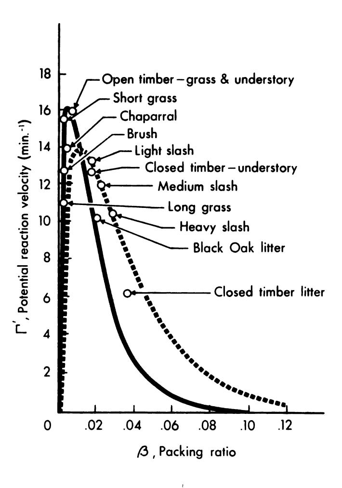

The effect of the change in fuel arrangement on potential reaction velocity is shown in figure 23. The flashy fuels (grass and brush) have the highest values; the closed timber litter has the lowest. Note that the grass and brush lie to the left of the optimum packing ratio under no-wind conditions. Inasmuch as one of the effects of wind is to shift the optimum packing ratio to the left, these fuels will burn extremely well under windy conditions.

The prediction of reaction intensity for the 11 fuel models is shown in figure 24 for fuel moisture ranging from 0 to extinction. All fuel models extinguish at  $M_f = 0.3$ , which is the value set by  $M_X$  for the dead fuel. The higher order variations for some fuel models are caused by the living fuel component's inability to burn when the dead fuel moisture becomes high. This is attributable to Fosberg and Schroeder's formulation (equation 88).

The prediction of rate of spread is shown in figure 25 at M = 0.04 (4 percent moisture content) in the dead fuel over a range of windspeeds from 0 to 12 m.p.h. (1,056 ft./min.) at the midflame height. Comparison between figures 24 and 25 reveals the sensitivity of the model to changes in fuel arrangement and the apparent agreement of the model to what can be expected qualitatively between the fuel models. The closed timber litter and the short grass have similar and low reaction intensities. However, the rate of spread differs dramatically for the two models in the presence of wind; the grass has the highest rate of spread, the litter the slowest. This is attributed to the contrast in porosity of the two fuels ( $\beta$  = 0.001 for grass, and  $\beta$  = 0.036 for the litter). This example illustrates the common misconception that rate of spread and reaction intensity are directly related.

Figure 24.--Reaction intensity of typical wildland fuels computed with heterogeneous formulations for the model from data in table 1.

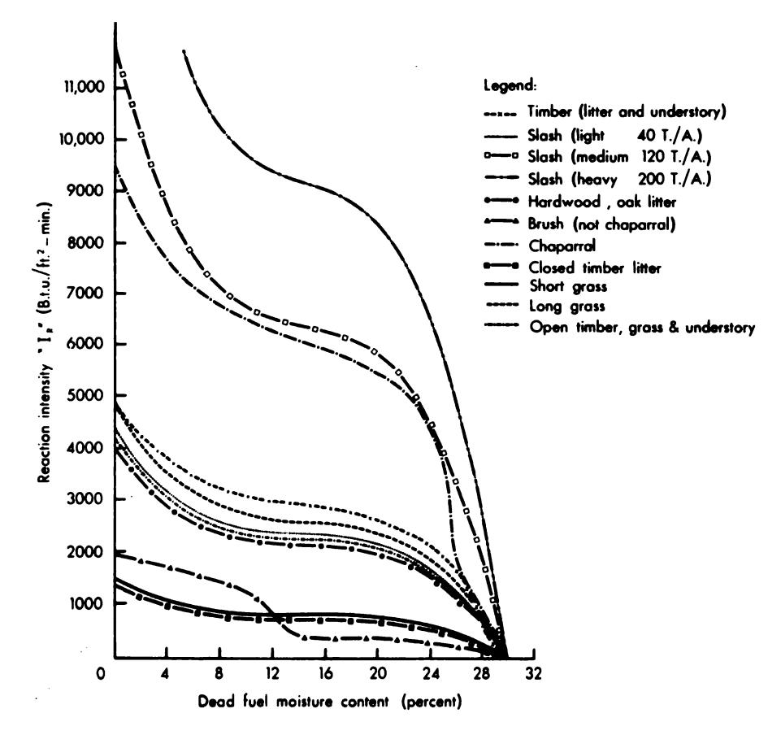

Heavy logging slash has by far the highest reaction intensity but a medium rate of spread; chaparral has both a high reaction intensity and a high rate of spread. It is gratifying that the model predictions are high in both values because the model was designed to represent the brush fields of the Southwest. These brush fields pose a severe fire hazard (Countryman, Fosberg, Rothermel, and Schroeder 1968).

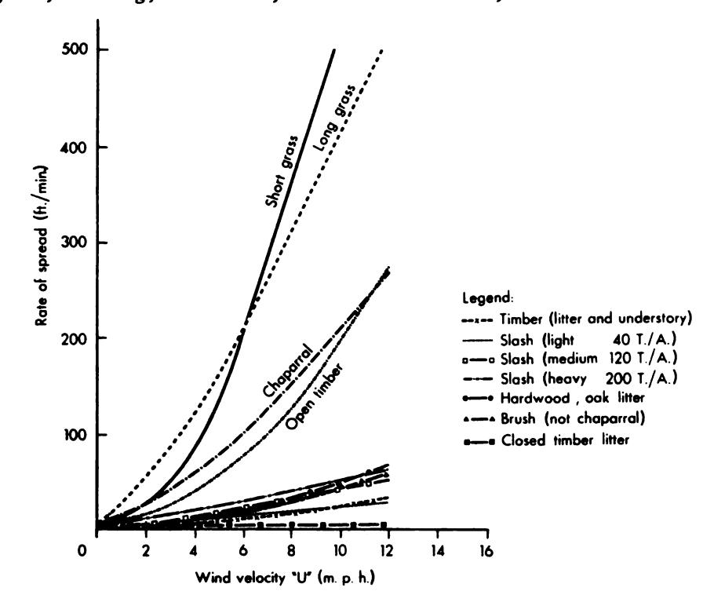

Figure 25.--Rate of spread of typical wildland fuels computed with heterogeneous formulations for the model from data in table 1 at Mf = 0.04 (4 percent moisture content) and windspeed = 12 m.p.h.

Figure 26.--Effect of moisture and minerals on rate of spread in a hypothetical fuel model.

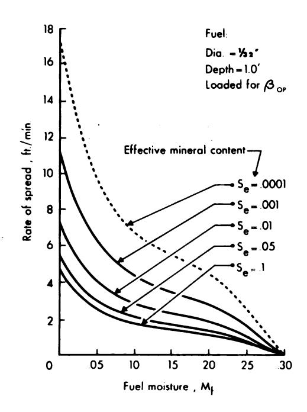

The positions of the curves in both figures 24 and 25 would be refined if fuel particle properties (h,  $\rho_p$ ,  $S_e$ ,  $M_x$ ) of the actual fuels were substituted for the mean values that were used in the fuel models.

To illustrate the relative effect of minerals and moisture on rate of spread, a typical homogenous fuel was chosen and rate of spread versus moisture was plotted (fig. 26). No attempt other than to discount silica was made to distinguish between the effects of different minerals.

Figure 27 illustrates the usefulness of the model to appraise fuels for management decisions. This figure shows the change in spread and intensity that could be expected in logging slash if it were burned under no-wind and 10 percent moisture conditions at various stages in decomposition. The ability of the model to predict fire severity as reflected in figure 27 should offer new opportunities for resource managers to integrate fuel management into resource planning activities.

Figure 27.--Change in spread and intensity in logging slash after aging. 1. New--when it had dried but retained its needles; 2. Intermediate--after sufficient aging to remove 50 percent of the needles and the depth of fuel had settled to 75 percent of its original value; 3. Old--sufficient aging to remove 100 percent of the needles and the depth of the fuel had settled to 50 percent of its original value.

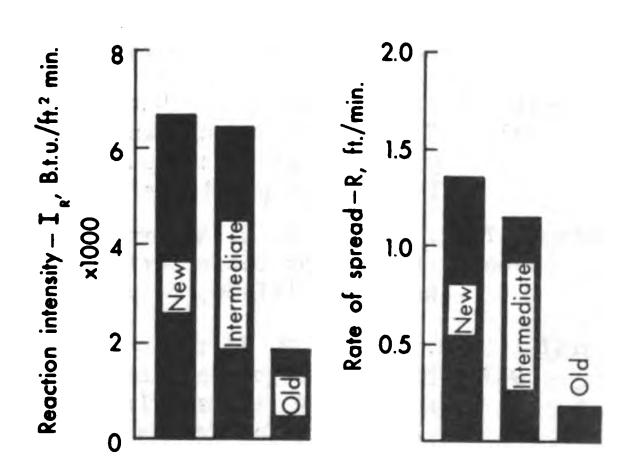

#### LITERATURE CITED

- Anderson, H. E.
  - 1968. Fire spread and flame shape. Fire Technol. 4(1):51-58.
- Anderson, H. E.
  - 1969. Heat transfer and fire spread. USDA Forest Serv. Res. Pap. INT-69, 20 p., illus.
- Berlad, A. L.
  - 1970. Fire spread in solid fuel arrays. Combust. and Flame 14:123-236.
- Brown, J. K.
  - 1972. Field test of a rate-of-fire-spread model in slash fuels. USDA Forest Serv. Res. Pap. INT-116, 24 p., illus.
- Countryman, C. M., M. A. Fosberg, R. C. Rothermel, and M. J. Schroeder 1968. Fire weather and fire behavior in the 1966 loop fire. Fire Technol. 4(2): 126-141, illus.
- Deeming, J. E., J. W. Lancaster, M. A. Fosberg, R. W. Furman, and M. J. Schroeder 1972. The National Fire Danger Rocky Mountain Rating System 1972. USDA Forest Serv. Res. Pap. RM-84, illus.
- Fons, W.
  - 1946. Analysis of fire spread in light forest fuels. J. Agr. Res. 72(3):93-121, illus.
- Fosberg, Michael A., and Mark J. Schroeder
  - 1971. Fine herbaceous fuels in fire-danger rating. USDA Forest Serv. Res. Note RM-185, 7 p.
- Frandsen, W. H.
  - 1971. Fire spread through porous fuels from the conservation of energy. Combust. and Flame 16:9-16, illus.
- McArthur, A. G.
  - 1969. The Tasmanian bushfires of 7th February, 1967, and associated fire behaviour characteristics. In The Technical Co-operation Programme. Mass Fire Symposium (Canberra, Australia 1969) v.I. 23 p. Maribyrnong, Victoria: Defence Standards Laboratories.
- Philpot, C. W.
  - 1968. Mineral content and pyrolysis of selected plant materials. USDA Forest Serv. Res. Note INT-84, 4 p.
- Philpot, Charles W., and R. W. Mutch
  - 1971. The seasonal trends in moisture content, ether extractives, and energy of ponderosa pine and Douglas-fir needles. USDA Forest Serv. Res. Pap. INT-102, 21 p., illus.
- Rothermel, R. C., and H. E. Anderson
  - 1966. Fire spread characteristics determined in the laboratory. U.S. Forest Serv. Res. Pap. INT-30, 34 p., illus.
- Tarifa, C. S., and A. M. Torralbo
  - 1967. Flame propagation along the interface between a gas and a reacting medium. P. 533-544, illus., In: Eleventh Symposium (International) on Combustion (Berkeley, California 1967). Pittsburgh: The Combust. Inst.