#### RESEARCH ARTICLE

10.1002/2017MS001108

#### **Kev Points:**

- An accurate and computationally efficient level-set algorithm for wildfire modeling has been implemented in WRF-Fire
- Fire rate-of-spread errors compared to standard low-order level-set algorithms not solving a reinitialization PDE are substantially reduced
- Representation of fire-front gradients and performance in complex fuel scenarios are considerably improved

#### **Correspondence to:**

D. Muñoz-Esparza, domingom@ucar.edu

#### Citation:

Muñoz-Esparza, D., Kosović, B., Jiménez, P. A., & Coen, J. L. (2018). An accurate fire-spread algorithm in the Weather Research and Forecasting model using the level-set method. *Journal of Advances in Modeling Earth Systems*, 10, 908–926. https://doi.org/10.1002/2017MS001108

Received 26 JUN 2017 Accepted 7 MAR 2018 Accepted article online 12 MAR 2018 Published online 2 APR 2018

# This is an open access article under the terms of the Creative Commons Attribution-NonCommercial-NoDerivs License, which permits use and

© 2018. The Authors.

made.

distribution in any medium, provided the original work is properly cited, the use is non-commercial and no modifications or adaptations are

## An Accurate Fire-Spread Algorithm in the Weather Research and Forecasting Model Using the Level-Set Method

Domingo Muñoz-Esparza1 D, Branko Kosović1 D, Pedro A. Jiménez1, and Janice L. Coen1

1National Center for Atmospheric Research, Boulder, CO, USA

**Abstract** The level-set method is typically used to track and propagate the fire perimeter in wildland fire models. Herein, a high-order level-set method using fifth-order WENO scheme for the discretization of spatial derivatives and third-order explicit Runge-Kutta temporal integration is implemented within the Weather Research and Forecasting model wildland fire physics package, WRF-Fire. The algorithm includes solution of an additional partial differential equation for level-set reinitialization. The accuracy of the firefront shape and rate of spread in uncoupled simulations is systematically analyzed. It is demonstrated that the common implementation used by level-set-based wildfire models yields to rate-of-spread errors in the range 10–35% for typical grid sizes ( $\Delta = 12.5-100$  m) and considerably underestimates fire area. Moreover, the amplitude of fire-front gradients in the presence of explicitly resolved turbulence features is systematically underestimated. In contrast, the new WRF-Fire algorithm results in rate-of-spread errors that are lower than 1% and that become nearly grid independent. Also, the underestimation of fire area at the sharp transition between the fire front and the lateral flanks is found to be reduced by a factor of  $\approx$ 7. A hybrid-order level-set method with locally reduced artificial viscosity is proposed, which substantially alleviates the computational cost associated with high-order discretizations while preserving accuracy. Simulations of the Last Chance wildfire demonstrate additional benefits of high-order accurate level-set algorithms when dealing with complex fuel heterogeneities, enabling propagation across narrow fuel gaps and more accurate fire backing over the lee side of no fuel clusters.

#### 1. Introduction

Large wildland fires can have significant direct and indirect effects on the Earth system. Direct effects include modification of land cover, ecosystem, and hydrology. Wildland fires indirectly affect visibility, air quality, surface albedo, as well as solar irradiance and cloud microphysics. To accurately assess the effect of wildland fires on the Earth system, it is therefore important to accurately model wildland fire spread. However, wildland fire modeling remains a challenging earth system modeling problem due to the intricate interactions between fire and atmosphere, the disparate scales between weather and combustion processes, the complexity in fuel characteristics and distribution, topography, and the spatiotemporal variability of atmospheric conditions. An emerging approach to represent several of these relevant processes and interactions is the use of coupled numerical weather prediction (NWP) and fire behavior models (e.g., Clark et al., 2004; Coen et al., 2013; Filippi et al., 2009; Mandel et al., 2011). While physically based models (e.g., Linn & Cunningham, 2005; Mell et al., 2007) explicitly account for most of the combustion processes, they require grid cell sizes of a meter or less and therefore, at present, cannot be utilized for real-time wildfire prediction. Grid size limitations can be relaxed by parameterizing combustion effects, namely the postfrontal heat release that is fed back as a forcing to the atmospheric NWP model (Clark et al., 2004). In addition to that, the fire rate of spread needs to be parameterized, typically based on semiempirical formulations that relate the rate of spread to bulk quantities such as wind speed, moisture, and terrain slope (Sullivan, 2009). The last component of the fire behavior model is the mathematical technique used to track and propagate the fire perimeter, which utilizes the rate-of-spread parameterization as driving parameter. Fire-front tracking and propagation is typically performed employing the levelset method (Osher & Sethian, 1988), although other techniques such as Lagrangian tracer particles (Clark et al., 2004) or the method of markers (Filippi et al., 2009) are used in coupled atmospheric/wildfire models. While minor differences have been found in between level-set and marker methods (Bova et al., 2016), the level-set technique has a more fundamental mathematical base, is widely used for range of

10.1002/2017MS001108

applications as evident from references provided in the manuscript and is subject to continuous improvements and developments.

Coupled wildland fire atmosphere modeling systems have several sources of errors and uncertainties. Errors and uncertainties in the predicted atmospheric state arising due to inaccuracies and uncertainties in the initial and boundary conditions, which combine with errors in the discretization of the governing equations and the errors/uncertainties in the parameterization of physical processes. Uncertainties in firespread modeling are associated with fuel type and distribution, and parameterization of subgrid-scale fire physics. Distinguishing error contributions from each of the specific components of the modeling system is a complicated task, considering the coupled nature of the model, uncertainties in inputs such as fuel, and the limited field data available for validation. An accurate representation of fire rate-of-spread is not only important for wildfire forecasting applications, but is also tied to burning rate and therefore it is critical to correctly represent biomass burning emissions and aerosols for atmospheric chemistry and air guality predictions within regional and climate models (Grandey et al., 2016; Paton-Walsh et al., 2012; Wiedinmyer et al., 2011). The way in which the interface algorithm is implemented is another potential source of error, one which has implications for interpretation of fire behavior but has largely gone unquantified. It will be shown herein that inadequate level-set implementations result in errors that are comparable to the ones from rate-of-spread parameterizations, therefore stressing the importance of numerical implementation of the tracking algorithm to improve overall accuracy of coupled wildland fire atmosphere models.

Semiempirical rate-of-spread models inevitably introduce errors in wildland fire prediction. To determine and quantify sources of model error, so that appropriate model components can be improved and error reduced, it is essential to first reduce errors associate with their numerical implementation. Accurate implementation of the level-set method is required for the fire front to propagate at the speed dictated by the rate-of-spread parameterization. Despite the widespread application of the level-set method to wildfire models (Coen et al., 2013; Lautenberger, 2013; Mallet et al., 2009; Mandel et al., 2011; Rehm & McDermott, 2009; Rochoux et al., 2014), all these numerical implementations for fire-spread modeling applications are based on low-order discretizations, which are at most second-order accurate but typically just first order. On the contrary, the large majority of the research literature on level-set methods in applications other than wildland fire discretizes the level-set partial differential equation (PDE) using some sort of combination of third-order or fifth-order weighted essentially nonoscillatory (WENO) schemes (Jiang & Shu, 1996) for the advective term and second-order or third-order Runge-Kutta discretization for the time derivative (e.g., Calderer et al., 2014; Luo et al., 2016; Xu et al., 2012; Yang & Stern, 2009). In addition, it is well known that the level-set function compresses/expands in certain regions due to spatiotemporal variability in the advecting velocity field, in turn resulting in numerical errors as the level-set equation is evolved forward in time (e.g., Chopp, 1993; Sussman et al., 1994). To circumvent this problem, the level-set function must be periodically re-adjusted so it remains a signed distance function. This effect is typically achieved through the use of reinitialization techniques, which will be discussed later in the manuscript. Nevertheless, essentially all current wildfire-spread simulations codes that use the level-set method do not incorporate any reinitialization technique, with the exception of Mallet et al. (2009).

In the present work, we implement a high-order accurate level-set algorithm for fire-front tracking and propagation using third-order and fifth-order WENO schemes for the discretization of spatial derivatives and third-order explicit Runge-Kutta temporal integration within the wildland fire physics package (WRF-Fire) in the Weather Research and Forecasting (WRF) model, including solution of an additional PDE for level-set reinitialization. The influence of the numerical implementation of the level-set method in the context of wildland fire modeling is then investigated. In addition, a hybrid-order approach that is as accurate as high-order implementations near the fire front yet considerably reduces the computational cost is proposed. The accuracy of the simulated fire-front shape and rate of spread are systematically analyzed using cases of increasing complexity, demonstrating the benefits of a higher-order discretization combined with a reinitialization technique in wildland fire models. The organization of the remainder of the paper is as follows. Section 2 presents the implementation details and numerical schemes employed by the level-set algorithm and briefly describes the wildfire rate-of-spread model. Three suits of test cases with increasing degree of complexity are analyzed in sections 3–5 to quantify the improvements

10.1002/2017MS001108

obtained with the level-set methodology herein proposed. These are namely a uniform velocity field, two idealized convective boundary layers, and a real wildfire event (the Last Chance fire, which occurred in Colorado 2012). Finally, section 6 summarizes the main conclusions and discusses ongoing research efforts.

#### 2. New WRF-Fire Level-Set Algorithm

#### 2.1. Level-Set Equations

The level-set method, devised by Osher and Sethian (1988), is one of the most commonly used numerical techniques to track interfaces in computational physics problems. The level-set method was recently applied to track and propagate the fire front in wildfire models (Coen et al., 2013; Lautenberger, 2013; Mallet et al., 2009; Mandel et al., 2011; Rehm & McDermott, 2009; Rochoux et al., 2014), where the level-set function,  $\varphi$ , is used to separate the unburned areas ( $\varphi > 0$ ) from the burned and burning regions ( $\varphi < 0$ ), with  $\varphi = 0$  denoting the fire front (i.e., the interface between the fire area and the unburned fuels). Under the assumption that the fire propagates in the normal direction to the interface and given that the fuels are considered to be only present at the earth's surface, we use a two-dimensional level-set formulation of a motion in the normal direction. The fire front is captured with the level zero of the level-set filed,  $\varphi(x,y,t)=0$ , which is initially prescribed to be a signed distance function. The interface is given by  $\Gamma = \{(x,y,t)|\varphi(x,y,t)=0\}, (x,y)\in \Omega$ , with  $\varphi(x,y,t)<0$  if  $(x,y)\in \Omega^-$  and  $\varphi(x,y,t)>0$  if  $(x,y)\in \Omega^+$  for any  $t\geq 0$ . The level-set field is advected by the rate-of-spread velocity (equation (10)) and satisfies the following Hamilton-Jacobi equation:

$$\frac{\partial \varphi}{\partial t} + R_f[|\nabla \varphi| - \epsilon \Delta \varphi] = 0, \tag{1}$$

$$\mathbf{n} = \nabla \varphi / |\nabla \varphi|,\tag{2}$$

where  ${\bf n}$  is the normal vector,  $\nabla \varphi = (\partial \varphi/\partial x, \partial \varphi/\partial y)$ ,  $\epsilon \Delta \varphi$  represents an artificial viscosity stabilizer formulated in terms of the Laplace operator times the grid size,  $\Delta \varphi = \Delta x \partial^2 \varphi/\partial x^2 + \Delta y \partial^2 \varphi/\partial y^2$ , with a grid-independent coefficient  $\varepsilon$  (Mandel et al. (2011) recommends  $\epsilon = 0.4$  in order to avoid numerical instabilities). Note that all the spatial operators are two dimensional, and correspond to a horizontal plane at the surface. In equation (1),  $R_f$  represents the fire rate of spread, which in the particular case is a function of the midflame velocity and terrain gradient in the normal direction,  ${\bf u}_f \cdot {\bf n}$  and  $\nabla z_T \cdot {\bf n}$ , respectively (see the details of the rate-of-spread parameterization in section 2.3).

As the interface evolves,  $\varphi$  will generally deviate from its initial value and no longer be a signed distance function. To circumvent this problem, Chopp (1993) introduced the concept of *reinitialization* to reduce the numerical errors caused by both steepening and flattening effects. While reinitialization of the level-set field could be performed by explicitly calculating distances from  $\varphi=0$  periodically throughout the course of a simulation, this approach is computationally too expensive. Instead, the common practice is to solve a reinitialization equation that can be iterated until it reaches a steady state solution (Sussman et al., 1994), corresponding to a signed distance function (see more details in section 2). To maintain the desired signed distance nature of the level-set field, we regularly solve the reinitialization equation proposed by Sussman et al. (1994),

$$\frac{\partial \varphi}{\partial \tau} + S(\varphi_0)[|\nabla \varphi| - 1] = 0, \tag{3}$$

where  $S(\varphi_0) = \varphi_0 (\varphi_0^2 + \Delta x^2)^{-1/2}$ ,  $\varphi_0$  is the level-set function after integrating equation (1), and  $\tau$  is a pseudo time.

#### 2.2. Discretization of the Level-Set PDEs

The equations governing the spatiotemporal evolution of the level-set function need to be discretized to be numerically solved. For clarity of exposition, we consider one-dimensional derivatives instead of two-dimensional spatial derivatives as used by the algorithm, however, extension to 2 or 3 dimensions is straightforward. For the spatial discretization, derivatives at a cell the center, i, are approximated by using the difference of the two neighboring face values,  $\hat{\varphi}_{i+1/2}$  and  $\hat{\varphi}_{i-1/2}$ , in the following manner:

$$\left. \frac{\partial \varphi}{\partial x} \right|_{i} = \frac{\hat{\varphi}_{i+1/2} - \hat{\varphi}_{i-1/2}}{\Delta x}.\tag{4}$$

Depending on the number of points used to reconstruct  $\hat{\varphi}$  at the faces, different orders of accuracy for the discretized derivatives are obtained. In order to avoid grid-scale noise near sharp level-set gradients, odd-order schemes with upwinding are required to discretize the advective term on the level-set equation. The level-set implementation in the WRF-based coupled models, presented in Mandel et al. (2011), applies a first-order essentially nonoscillatory (ENO) scheme (Osher & Fedkiw, 2006) for the discretization of the advective term. For a positive advection velocity, the first-order ENO scheme (ENO1), reconstructs the face value as follows:

$$\hat{\varphi}_{i+1/2} = \varphi_i. \tag{5}$$

In the case of opposite-sign converging velocities at the i+1/2 and i-1/2 faces (local maximum),  $\partial \varphi/\partial x|_i$  is the signed one-sided difference with the largest absolute value of the two faces. For opposite-sign diverging velocities at the i+1/2 and i-1/2 faces (local minimum),  $\partial \varphi/\partial x|_i$  is set to 0 (Mandel et al., 2011).

We have additionally implemented both third-order and fifth-order WENO schemes (WENO3, WENO5). The WENO schemes have the advantage over the ENO schemes that they use a weighted combination of several reconstructions instead of a unique one, therefore improving accuracy (Jiang & Shu, 1996). The numerical reconstruction at the face is calculated as

$$\hat{\varphi}_{i+1/2} = \sum_{m=1}^{n} w_m \hat{\varphi}_{i+1/2}^{(m)}.$$
 (6)

The nonlinear weights are given by

$$w_m = \frac{\tilde{w}_m}{\sum_{l=1}^n \tilde{w}_l}, \quad \tilde{w}_l = \frac{\gamma_l}{(\lambda + \beta_l)^2}. \tag{7}$$

In equation (7),  $\gamma_l$  is the linear weight,  $\beta_l$  is the smoothness indicator and  $\lambda$  is a parameter to avoid the denominator becoming zero (=10-6 in our calculations). To achieve third-order accuracy, two second-order reconstructions:  $\hat{\varphi}_{i+1/2}^{(1)}$  and  $\hat{\varphi}_{i+1/2}^{(2)}$  are used (n=2), while the fifth-order WENO scheme utilizes three third-order accurate reconstructions:  $\hat{\varphi}_{i+1/2}^{(1)}$ ,  $\hat{\varphi}_{i+1/2}^{(2)}$ , and  $\hat{\varphi}_{i+1/2}^{(3)}$  (n=3). The reader is referred to Jiang and Shu (1996) for a description of the particular stencils utilized in the implementation of the WENO schemes, together with their corresponding linear weights and smoothness indicators. In order to determine the upwinding direction for the WENO schemes, equations (1) and (3) need to be recast in their equivalent vectorial form. After doing some manipulation and neglecting  $|\nabla \varphi|$  and  $R_f$  that are positive by definition, it is easy to prove that  $\nabla \varphi$  and  $S(\varphi_0)\nabla \varphi$  are the terms to be evaluated in order to determine the upwinding direction for the discretization of the advective terms in the level-set and reinitialization equations, respectively. Since these have a circular dependency through requirement of the calculation of spatial gradients of  $\varphi$ , we use fourth-order centered differences to determine the upwinding direction of the stencil:

$$\hat{\varphi}_{i+1/2} = \frac{7}{12} (\varphi_{i+1} + \varphi_i) - \frac{1}{12} (\varphi_{i+2} + \varphi_{i-1}). \tag{8}$$

We have implemented a third-order ERK scheme for time integration (the release versions of WRF-Fire and WRF-SFIRE use second-order ERK). A third-order ERK is needed when using fifth-order WENO spatial discretization not to be either unstable or constrained to an unrealizable small time step to maintain numerical stability (Motamed et al., 2011; Wang & Spiteri, 2007). However, third-order ERK has the property of being stable for larger  $\Delta t$  compared to second-order ERK. This is a desirable feature in our code where the level-set grid can be refined from the atmospheric model grid, therefore constraining the largest  $\Delta t$  that can be used. The implemented three-stage third-order ERK scheme for temporal integration is

$$\varphi^* = \varphi^t + \frac{\Delta t}{3} \operatorname{FR}(\varphi^t); \varphi^{**} = \varphi^t + \frac{\Delta t}{2} \operatorname{FR}(\varphi^*); \varphi^{t + \Delta t} = \varphi^t + \Delta t \operatorname{FR}(\varphi^{**}), \tag{9}$$

where FR is the right-hand-side forcing term. Moreover, we have implemented the level-set to be fully parallelized for efficiency and flexibility, in contrast to earlier works of WRF-Fire and WRF-SFIRE that both perform redundant calculations outside of the parallel partition for each processor and because of that do not

allow for any other combination of numerical schemes than first-order accurate in space and second-order in time.

#### 2.3. Cell Ignition, Fuel Burnout, and Rate of Spread

The time evolution of the level set is used to determine when a cell ignites, corresponding to the time at which  $\varphi_{ij}$  becomes negative for the first time. Since such transition from positive to negative often occurs in between time steps, the ignition time,  $t_{ii}$  is linearly approximated using the rate of change of the level set between  $\varphi_{ij}^t \geq 0$  when the cell is not ignited and  $\varphi_{ij}^{t+\Delta t} < 0$  when the cell is already burning. The ignition time is then used to determine the bidimensional fuel fraction field, F, which is initially set to 1 for unignited fuels. Based on laboratory experiments (Albini & Reinhardt, 1995), it is assumed that F decreases exponentially in time from the ignition,  $F^t = \exp\left[-(t-t_i)/t_f\right]$ , where  $t_f$  is the burn time, or seconds for each specific fuel to burn down to  $\approx 0.3789$  ( $t=t_i+t_f$ ). After the fuel fraction is updated, the decrease of F between two consecutive time steps,  $\Delta F = F^{t+\Delta t} - F^t$  is used to calculate the sensible and latent heat fluxes generated by the wildfire and feed back into the atmospheric model (Clark et al., 2004). In order to have a more accurate representation of fuel fraction and a more progressive release of heat fluxes,  $\varphi$  and  $t_i$  are interpolated down to four subcells in the fire grid (two subdivisions in each direction) and used to integrate the fuel fraction as described in Mandel et al. (2011) (not to be confused with the refinement of the fire grid for the level set).

The fire rate of spread,  $R_{fr}$  is parameterized following Rothermel (1972) semiempirical formulation:

$$R_f = R_0 (1 + \phi_w + \phi_s) = R_0 \left[ 1 + \alpha_1 (\boldsymbol{u}_f \cdot \boldsymbol{n})^{\alpha_2} + \alpha_3 (\nabla z_T \cdot \boldsymbol{n})^2 \right]. \tag{10}$$

In equation (10),  $R_0$  is the rate of spread in the absence of wind and terrain slope,  $\phi_w$  is the wind correction,  $\phi_s$  is the terrain slope correction,  $\mathbf{u}_f$  is the midflame height horizontal wind vector, and  $z_T$  is the terrain height. The rest of model coefficients  $R_0$ ,  $\alpha_1$ ,  $\alpha_2$ ,  $\alpha_3$ , depend on fuel characteristics and their particular values for the 13 fuel categories from Anderson (1982) can be found in Rothermel (1972).

### 3. Fire Spread Under a Uniform Velocity Field

In this and the following sections, the influence of the level-set algorithm on fire-spread characteristics is analyzed in detail using cases of increasing complexity. In order to isolate the effects caused by the level-set algorithm and not to include variations due to fire feedbacks into the atmosphere, heat fluxes arising from the burning fuel where prescribed to be zero for all the simulations and analysis presented herein. Therefore, the forcing velocity field remains unmodified by the presence of the fire, yet drives its propagation.

At first, we focus on the simplest possible case, where the atmospheric flow is characterized by a spatially uniform velocity field (u, v, w) = (5.0, 0, 0) m s-1 aligned in the *x*-direction that does not vary with time. Such uniform velocity field is achieved by imposing a free-slip surface boundary condition, hence precluding any shear to develop near the surface like would happen in the presence of surface drag (see section 4). Lateral boundary conditions are periodic and a Neumann zero-gradient condition is imposed at the model top. The domain is  $L_x \times L_y \times L_z = 5.0 \times 5.0 \times 2.0$  km3, and the resolution for the atmospheric grid is  $\Delta z = 20$  m in the vertical direction. Several horizontal grid resolutions were tested,  $\Delta x = \Delta y = 12.5$ , 25, 50, and 100 m. For this particular case where the flow is homogeneous and there are no feedbacks from the fire to the atmospheric model, the forcing velocity field remains one-dimensional as initially specified. A fire line ignition pattern is considered with dimensions  $(\ell_x, \ell_y) = (1.0 \div 1.0 + \Delta, 2.0 \div 3.0)$  km, and that ignites 10 s after the simulation starts. Third-order ERK scheme was used for time integration in all cases since tests comparing second-order and third-order time marching schemes revealed negligible differences for the analyzed cases (not shown).

Figure 1 shows time evolution of the fire area or horizontally integrated burned fuel fraction,  $\sum_{xy} F_b \Delta x \Delta y$ , where  $F_b = 1 - F$ . For the three advection schemes (ENO1, WENO3, and WENO5), the solution converges as the grid size is decreased, with differences between grid sizes decreasing with increased resolution, as expected. Comparison between ENO1 and WENO5 schemes (Figure 1a) shows that the more dissipative first-order scheme systematically results in a lower fire area throughout the course of the simulation. As an example, WENO5 with  $\Delta = 25$  m produces a time evolution of fire area that almost perfectly matches the one obtained with ENO1 using  $\Delta = 12.5$  m, thus requiring 4 times less grid points. On the contrary, third-

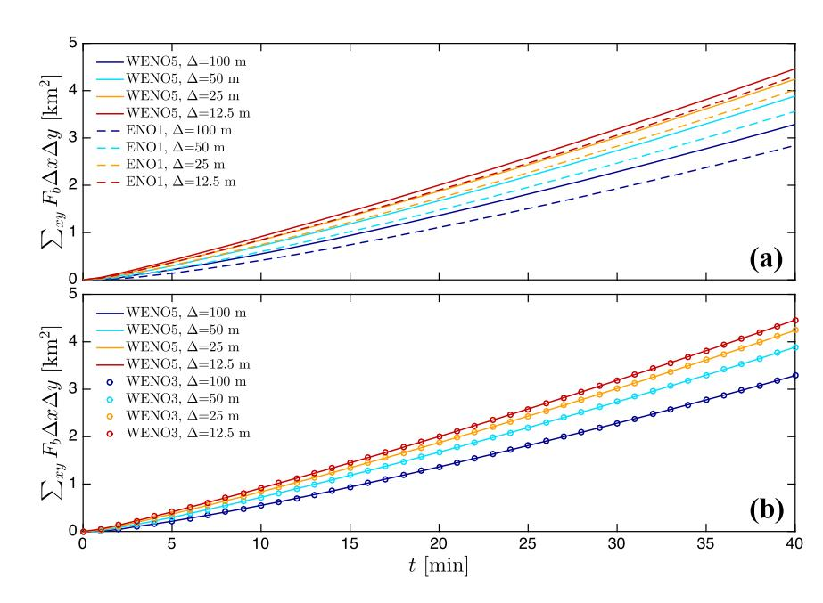

**Figure 1.** Time evolution of fire area or horizontally integrated burned fuel fraction,  $\sum_{xy} F_b \Delta x \Delta y$ , for different grid resolutions  $\Delta = 12.5, 25, 50$ , and 100 m. Sensitivity of level-set method to the advection scheme. Comparison of (a) ENO1-WENO5 and (b) WENO3-WENO5 schemes. No reinitialization with  $\epsilon = 0.4$ . Uniform velocity case.

order and fifth-order WENO schemes produce almost identical temporal evolution of the fire area (Figure 1b), with minor underestimations of 0.1% by WENO3 during the early transition stages from the initial fire line, which totally disappear in time and with increased grid resolutions. While the argument could be made that ENO1 with ERK2 used by earlier versions of WRF-Fire and also WRF-SFIRE is computationally less expensive, we found that our implementation of level-set with WENO5 and ERK3 only increases the cost by 15%, which is much less than the cost of augmenting the horizontal resolution by a factor of 2.

As mentioned in section 1, the majority of level-set wildfire codes do not incorporate any reinitialization technique (e.g., Coen et al., 2013; Lautenberger, 2013; Mandel et al., 2011; Rehm & McDermott, 2009; Rochoux et al., 2014), therefore it is worth investihating the effects of such omission. Figure 2a shows the differences in fire area with WENO5 with and without performing reinitialization. For the cases using reinitialization, equation (3) is solved for 1 iteration after advancing 1 time step of the level-set advection (not after every stage of the Runge-Kutta scheme). For the cases with level-set reinitialization (solid lines), fire area is larger due to reduced numerical errors, and the rate of convergence on  $\Delta$  is accelerated. The improvement obtained from the use of reinitialization results in a solution with  $\Delta = 50$  m superior to the one obtained with  $\Delta = 12.5$  m and no reinitialization. Further improvement can be achieved by lowering the artificial viscosity coefficient as shown in Figure 2b. There, we performed simulations using WENO5 and reinitialization but decreasing  $\epsilon$ . We found that  $\epsilon=0.1$  is sufficient for our high-order level-set implementation with reinitialization to be numerically stable, compared to the value of 0.4 recommended by Mandel et al. (2011). With a reduced artificial viscosity coefficient, fire area for grid sizes of  $\Delta = 12.5$ , 25, and 50 m are nearly indistinguishable, demonstrating that grid convergence has been achieved for  $\Delta = 50$  m. Interestingly, this substantial reduction of artificial viscosity does not seem to have such a strong influence compared to the use of high-order discretization and reinitialization of the level set. This is due to the fact that the artificial viscosity term in the level-set advection equation is formulated as a Laplace operator, involving a second derivative of the level-set field. After reinitialization is applied,  $|\nabla \phi| \approx 1.0$ , therefore removing most of the effect from the artificial viscosity term, and only acting in the presence of numerical instabilities. Additional tests performed without reinitialization exhibited a similar impact of artificial viscosity as the one observed for reinitialization in Figure 2a.

To further understand the impact of numerical discretization, reinitialization, and artificial viscosity on the level-set solution, fire perimeters ( $\varphi = 0$ ) after 35 min from ignition are presented in Figure 3a for some of

10.1002/2017MS001108

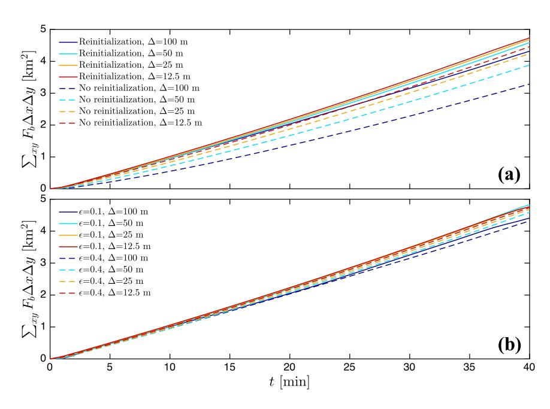

**Figure 2.** Time evolution of fire area or horizontally integrated burned fuel fraction,  $\sum_{xy} F_b \Delta x \Delta y$ , for different grid resolutions  $\Delta = 12.5, 25, 50$ , and 100 m. Sensitivity of level-set using WENO5 scheme to (a) reinitialization and (b) artificial viscosity (reinitialization applied).

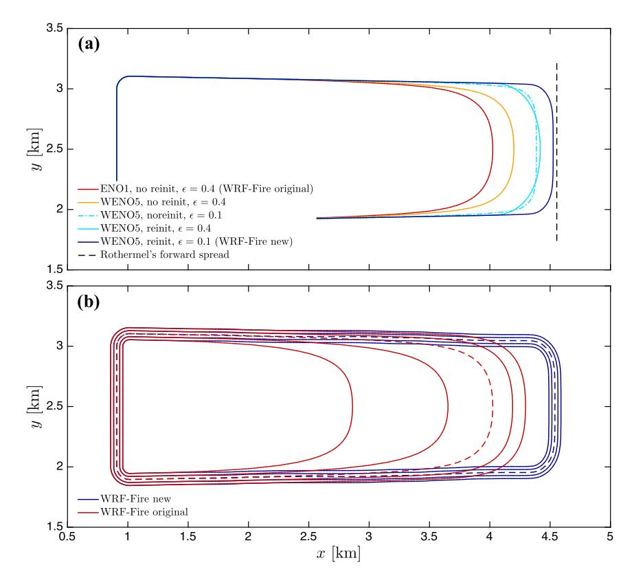

**Figure 3.** (a) Isocontours of fire perimeter,  $\varphi=0$ , using different implementations of the level-set algorithm. (b) Isocontours of  $\varphi=[-4\Delta x:2\Delta x:4\Delta x]$  from the new and original WRF-Fire. Results are valid at t=35 min from ignition and correspond to  $\Delta=25$  m. Dashed lines indicate the fire perimeter location,  $\varphi=0$ .

10.1002/2017MS001108

the numerical experiments with  $\Delta=25$  m. As expected, the fire propagates along the x-direction, resulting in a fire perimeter that is symmetric with respect to the y axis due to the uniform streamwise velocity imposed. While the main fire propagation occurs in the positive x-direction, the fire experiences some backward propagation or backing from the initial ignition location  $\ell_x = 1.0$  km. This is due to the fire-spread model, which even when  $\mathbf{u}_f \cdot \mathbf{n} = 0$ , retains the background term that represents the fire propagation under no-wind conditions or fire backing (i.e., wind blowing in the opposite direction),  $R_0$  in equation (10). For this particular case where we utilized Anderson's fuel type 1 (short grass), a value of  $R_0 = 0.018$  m s-1 was obtained, while the forward rate of spread was  $R_f = 1.701$  m s-1. These perimeters reveal that there are two facets to the numerical error that contribute to underestimating the fire area and its temporal growth. One is related to the speed of propagation of the fire front, and the other is related to the ability to preserve sharp edges. The increase in the order of the numerical scheme from ENO1 to WENO5 results on a considerable improvement in the rate of spread due to the inherently lower dissipative errors of the latter, in turn producing a larger fire area. Either incorporating reinitialization of the level set or decreasing the artificial viscosity by a factor of 4 has a somewhat similar impact on the solution. Both aspects positively contribute to a larger area and increase the curvature of the fire front at the edges, with reinitialization contributing slightly more to the former than the latter compared to the reduction in artificial viscosity. By combining reinitialization and reduced artificial viscosity with fifth-order WENO scheme, the fire front is advanced approximately 500 m further downstream than with the original WRF-Fire scheme (and WRF-SFIRE) after 35 min from ignition. In particular, this comparison shows that a high-order discretization with low artificial viscosity together with a signed distance level-set field (achieved through reinitialization) implemented in the new WFR-Fire level-set algorithm are important for having both the right speed of propagation and the proper resolution of sharp gradients at the fire front.

To evaluate the quality of the level-set field, isocontours corresponding to  $\varphi = [-4\Delta x : 2\Delta x : 4\Delta x]$  are shown in Figure 3b for the new and original level-set algorithms in WRF-Fire. In the case of the new WRF-Fire, isocontours of  $\varphi$  after 35 min from ignition display a signed distance pattern. On the contrary, the original implementation produces spatial gradients of  $\varphi$  much smaller than 1.0, as it can be seen from the large separation between isocontours that should be two grid points spaced. Interestingly, this underprediction of  $|\nabla \varphi|$  results on a bow-shaped fire perimeter. Similar type of fire topology has been found in previous field campaigns and numerical modeling efforts (e.g., Canfield et al., 2014; Cheney et al., 1993; Clark et al., 1996a, 1996b; Linn & Cunningham, 2005). While in nature this is a physically plausible fire shape, it is solely induced by numerical errors in this particular case, since the fire-atmosphere feedbacks responsible for that process where not included in our uncoupled simulations in order to be able to isolate the errors originating from the level-set algorithm. Therefore, it is expected that in prior coupled simulations using the original WRF-Fire version, this curving of the fire front may have been overestimated due to the spurious contribution from the numerical errors in the level-set algorithm. Ongoing efforts are directed toward analyzing the effect of these errors induced by the level-set implementation in coupled simulations, including large wildland fire events. In contrast to the original WRF-Fire version, in the new WRF-Fire algorithm there is a very reduced smoothing of the fire-front edges attributed to the finite order of our numerical scheme, which is not expected to significantly interfere with the wildfire-atmosphere mechanisms responsible for the lateral spread and curvature in a wildfire.

This simple case was selected partially for its homogeneity in the fire-front propagation. In this particular scenario under uniform and steady forcing conditions and homogeneous fuel distribution, the input rate of spread into the level set from the Rothermel parameterization,  $R_f$  can be used to calculate the error in the rate of spread from the level-set algorithm. The resulting rate of spread from Rothermel's model,  $R_f$  was used to calculate the rate-of-spread error as follows:  $\text{Error}_{\text{ROS}}(\%) = [(R_f - R_{LS})/R_f] \times 100$ , where  $R_{LS}$  is the rate of spread obtained from the simulation, calculated using the distance covered by the  $\varphi = 0$  isocontour at the center of the fire front (y = 2.5 km) in 2 min intervals and averaged over 30 min. The ROS errors for all the different level-set implementations and grid resolutions are presented in Figure 4. The level-set implementation used by the original WRF-Fire algorithm (and WRF-SFIRE) produces errors of 35% for  $\Delta = 100 \text{ m}$ , which decrease to 10.22% for  $\Delta = 12.5 \text{ m}$  approximately following a linear trend. With WENO5 scheme and reinitialization, the error with  $\Delta = 100 \text{ m}$  is almost equal to the error of WRF-Fire discretization using a grid resolution 8 times smaller in every direction. Moreover, when high-order discretization, reinitialization and reduced artificial viscosity are combined in the new WRF-Fire algorithm, the errors are lower than 1% and become essentially independent of the grid resolution over the considered range ( $\Delta = 12.5-100 \text{ m}$ ). The

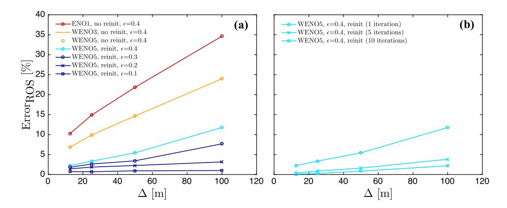

**Figure 4.** Rate-of-spread (ROS) errors as a function of grid size  $\Delta$  for (a) different implementations of the level-set algorithm and (b) influence of number of iterations for the reinitialization equation.

increase in computational cost associated with the use of WENO5 and the additional solution of the reinitialization equation is about 30%. However, 16 times more grid points would be needed with low-order discretization without solving a reinitialization equation to achieve the same accuracy, which would increase the computational cost by 1600%. Furthermore, additional cost arrives from the necessity to lower the time step for the solution to be numerically stable on a finer grid.

In all the results presented up to now, the reinitialization equation was solved only for 1 iteration every time step. Figure 4b shows the effect of performing several iterations for the reinitialization equation. The rate-of-spread error is progressively reduced when 5 and 10 iterations are performed. In particular, errors become <0.1% for  $\Delta=12.5$  m (even with an artificial viscosity coefficient of  $\epsilon=0.4$ ). While performing one iteration every time step results in rate-of-spread errors below 1% and such accuracy may be sufficient for forecasting applications where speed of computations is important, more accurate results can be obtained for other research-like applications with the new WRF-Fire algorithm by increasing the number of reinitialization iterations. However, it is worth noting that reinitialization should be accompanied by a reduction in the specified artificial viscosity coefficient to have a correct representation of strong gradients since artificial viscosity tends to smear out spatial variations of  $\varphi$ .

As already mentioned, there are two sources of error in the fire-front propagation. The previous error analysis focused on the rate-of-spread error calculated at the center of the fire front. This choice was made since it is essentially equivalent to the problem of one-dimensional fire spread (no spanwise effects), and can straightforwardly be compared to the predicted spread by Rothermel's relationship. In contrast, our fire model has a fire backing component, which makes the problem of propagation of a fire line ignition in the absence of feedback to the atmosphere two dimensional, and for which there is no analytical solution to compare with. Nevertheless, it is important to quantify the errors in preserving sharp edges, potentially occurring at the flanks of line fires. As a proxy for the exact solution, one can extrapolate from the rear part of the flanks,  $x \approx 1.0$ –2.5 km, where the fire perimeter is linear. This provides an accurate reference given that the normal component of the rate of spread at the flanks is reduced, mostly dominated by the backing fire component,  $R_0$ . At the front of the perimeter, where the level-set strictly propagates in the streamwise direction, a uniform line can be used, for spanwise locations (core region) encompassed by the intersections with the solution for the lateral flanks. In this way, the local error in fire area along the fire front can be calculated,  $E_0$  as similar fashion to the rate-of-spread error.

The fire area errors at t=35 min are shown in Figure 5 for different level-set implementations with a grid spacing of  $\Delta=25$  m. At the center of the fire front, the errors in fire area are the same as  $Error_{ROS}$ . However,  $Error_{FA}$  grows with distance from the center of the fire front, with the largest errors occurring at the departure from the linear flanks. This dependency is the result of the smoothing of the sharp transition ( $\approx90^\circ$ ) present between the fire head and the lateral flanks. While larger fire area underestimations are present at sharp transitions, there is a significant improvement when high-order level-set implementations that solve a reinitialization equation are used. In particular, fifth-order WENO with reinitialization and reduced artificial

10.1002/2017MS001108

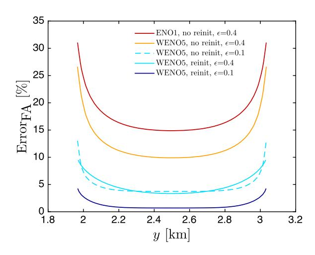

**Figure 5.** Fire area errors as a function of front location for different implementations of the level-set algorithm. Results are valid at t=35 min from ignition and correspond to  $\Delta=25$  m (corresponding to Figure 3a).

viscosity has a maximum error of 4.2%, which is reduced by a factor of  $\approx\!\!7$  compared to the original WRF-Fire implementation. Also, our improved level-set algorithm has a more reduced span around the sharp edge where the error tends to grow. Similar results are obtained for other grid spacings, not shown. It is worth mentioning that unlike the rate-of-spread error at the fire centerline, the error in fire area is case specific (i.e., it depends on time and initial fire line length). However, the results presented herein provide guidance on the improvement by more accurate level-set implementations.

### 4. An Efficient Hybrid-Order Level-Set Method With Locally Reduced Artificial Viscosity

A disadvantage of the level-set method is that despite the fact the only region of interest is  $\varphi$ =0, the level-set equations are commonly solved over the entire domain. From the methods proposed to mitigate that computational burden, the one proposed by Peng et al. (1999) has several advantages with respect to other local level-set methods (Adalsteinsson & Sethian, 1995; Sethian, 1996), in particular

the intuitive use of the level-set function to determine the local portion of the domain where the level-set equations are solved. However, it is still necessary to extend the band over which the level-set equations are solved to grid points that were previously not part of the band as the front advances, and therefore requires continuous reconstruction of the level-set field at the boundaries of the band. Although not explicitly mentioned in their paper, Peng et al. (1999) partially circumvented this issue by solving the reinitialization PDE over the entire computational domain and only the advection of the level set is performed locally (reinitialization is done globally). In addition, the blending toward zero of the advection term inside the local band can slow down the propagation of the front in cases where the level-set deviates from a signed-distance function or reinitialization is not performed frequently enough.

Herein, we propose a hybrid-order level-set method both for the advection and reinitialization equations that is high-order accurate for  $\varphi=$  0 and is relatively simple to implement. The idea is to localize the expensive high-order discretization of the level-set equations on a band  $|\varphi| \le \gamma \Delta x$ , where  $\gamma$  is the number of grid points away from the interface that conform the band. For  $|\phi| > \gamma \Delta x$ , the level-set equations are still solved but the advective terms are discretized using a computationally more efficient first-order ENO scheme. This approach eliminates the problem of extending the band or specifying boundary conditions near  $\varphi = 0$ , which can lead to inaccuracies in the level-set solution. In this manner, the more expensive high-order discretization is only used in the vicinity of the interface, substantially alleviating the computational expense required to integrate the level-set equations with high-order discretization over the entire domain. Moreover, the signed distance property of the level set is further exploited by combining the hybrid-order solution with a local reduction of the artificial viscosity down to  $\epsilon = 0.1$  for  $|\varphi| \le \gamma \Delta x$ , which results in accuracy improvements for the front shape and propagation as demonstrated in section 3. After experimenting with the parameter controlling the width of the band,  $\gamma$ , it was found that the number of grid points where the high-order scheme needs to be applied to obtain high-order accuracy is related to the grid points of the numerical stencil. Therefore,  $\gamma = 3$ , 4 is used for third-order and fifth-order schemes, respectively. Such choice ensures that the discretization is high order at the interface, with the order progressively blending toward low order recovered at  $(\gamma + 1)\Delta x$  from the interface.

In order to test the proposed hybrid-order level-set method and understand the impact of the numerical implementation approach in a more complex scenario than the uniform forcing velocity field presented in the previous section, fire propagation in two convective atmospheric boundary layers (ABLs) that include explicitly resolved turbulence was considered. In order to generate a fully developed turbulent ABL, the one-way nesting capability of the WRF model was utilized. The parent domain was set with  $\Delta x = \Delta y = 100 \text{ m}$ ,  $\Delta z = 20 \text{ m}$ , and  $L_x \times L_y \times L_z = 15.0 \times 15.0 \times 2.0 \text{ km}^3$ . A nested domain with increased horizontal resolution was nested inside the parent domain, receiving Dirichlet boundary conditions from it. Subgrid-scale (SGS) contributions were parameterized following Lilly (1966, 1967), which requires integration of an

additional transport equation for the SGS turbulent kinetic energy. The parent domain, with imposed lateral periodic boundary conditions, was run for a 3 h period prior to initializing the nested domain where the fire is contained. This was done in order for the shear generated and thermally induced turbulence to spin up and equilibrate within the ABL. For more details on the setup for a nested turbulent ABL the reader is referred to Muñoz-Esparza et al. (2014). All the numerical experiments were carried out in this case using the same grid resolution,  $\Delta = 12.5$  m. This choice is motivated by the fact that the grid resolution of the nested domain will determine the range of resolved scales and therefore solutions will differ when  $\Delta$  is varied, precluding any robust comparison in between single numerical realizations to be made.

In both setups the roughness length was specified to  $z_0 = 0.1$  m and surface drag was imposed using a parameterization based on Monin-Obukhov similarity theory (Monin & Obukhov, 1954) to represent unresolved surface roughness effects. Both domains were initialized with a uniform vertical profile of potential temperature,  $\theta$  = 300 K for z  $\leq$  1,000 m, capped by a two-layer inversion:  $\partial\theta/\partial z$  = 0.08 K m-1 from 1,000 to 1,150 m and  $\partial\theta/\partial z=0.003$  K m $^{-1}$  for z>1,150 m, to constrain the depth of the boundary layer to  $z_i\approx$ 1,000 m and to avoid turbulent eddies from reaching the domain top. Two distinct types of convective ABLs were generated by varying the imposed geostrophic wind (large-scale pressure gradient) and the surface sensible heat flux. In the first scenario, CBL1, the geostrophic wind was set to  $U_q = 15 \text{ m s}^{-1}$  and the surface heat flux to  $\langle w'\theta' \rangle_s = 0.015 \text{ K m s}^{-1}$ . For the second case, CBL2, the geostrophic wind was set to  $U_q = 5 \text{ m s}^{-1}$  and the surface heat flux to  $\langle w'\theta' \rangle_s = 0.050 \text{ K m s}^{-1}$ . Figure 6 shows probability distributions of surface wind speed fluctuations for the two cases, corresponding to the first grid point  $z_1 \approx 6.5$  m used to drive the fire propagation. Apart from the lower mean wind speed indicated in the legend, CBL1 displays a wider distribution of surface wind speed fluctuations, while CBL2 is characterized by weaker mean winds and fluctuations, bearing a narrower distribution. These differences allow testing of the level-set fire-spread model under a varied set of conditions. In addition, the designed setups were selected in such a way that the size and organization pattern of turbulence structures was different, as it will be shown later.

Time evolution of fire area for the CBL1 case shown in Figure 7a exhibits a slower rate of growth for the original WRF-Fire, with differences with respect to the new algorithm linearly increasing with time from ignition. In contrast, the different configurations of the new WRF-Fire, all including reinitialization, high-order discretization and reduced artificial viscosity converge to nearly identical results, with the simulation using WENO3 as the advection scheme resulting in a slightly lower fire area. In order to have a closer look at the differences in fire evolution due to level-set implementation, the instantaneous fuel burned,  $\sum_{xy} F_{bi} \Delta x \Delta y$ , is presented in Figure 7b. The hybrid-order level-set implementations using WENO3 and WENO5 as high-order scheme result in instantaneous burned fuels very similar to the reference case using WENO5 over the entire domain. In particular, the mean difference of the hybrid-order WENO5 implementation is -0.3652%, with a standard deviation of 0.8372% (compared to the new WRF-Fire with global WENO5). Similar results

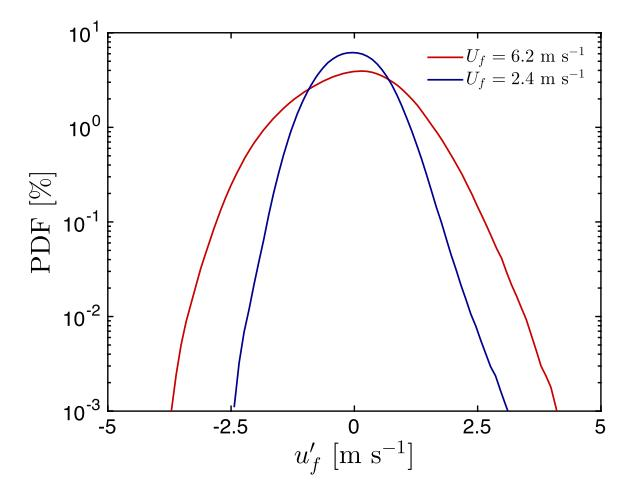

**Figure 6.** Probability distribution functions of surface wind speed fluctuations,  $u'_f$ , for the two turbulent convective ABLs with surface mean wind speeds of  $U_f = 6.2$  and  $2.4 \text{ m s}^{-1}$ , corresponding to the CBL1 and CBL2 cases, respectively.

are found for the CBL2 case, presented in Figure 8. In that case, the mean difference of the hybrid-order WENO5 implementation is -0.0343%, with a standard deviation of 1.5780%. In the two cases, the original WRF-Fire consistently underpredicts the fire area with respect to the new WRF-Fire implementation. An example of this effect is presented in Figures 9a and 10a, where  $\varphi = 0$  isocontours for the CBL1 and CBL2 cases valid at t = 20 and 55 min after ignition are shown, respectively. Such underprediction is to a considerable extent due to the lack of reinitialization, which results in a strong departure of the level-set field from a signed distance function, as it is shown in the level-set isocontours corresponding to  $\varphi = [-8\Delta x: 4\Delta x: 8\Delta x]$  from Figures 9b and 10b. Comparison between the fire perimeters from the new WRF-Fire using high-order discretization over the entire domain and the hybrid-order discretization further demonstrates the accuracy of our proposed hybrid-order method, yet considerably reduces the computational cost of the level-set algorithm.

Notable differences in the characteristics of the fire front are observed between the two convective boundary layers. In the CBL1 case, the fire perimeter develops a two-lobe structure, as a result from the

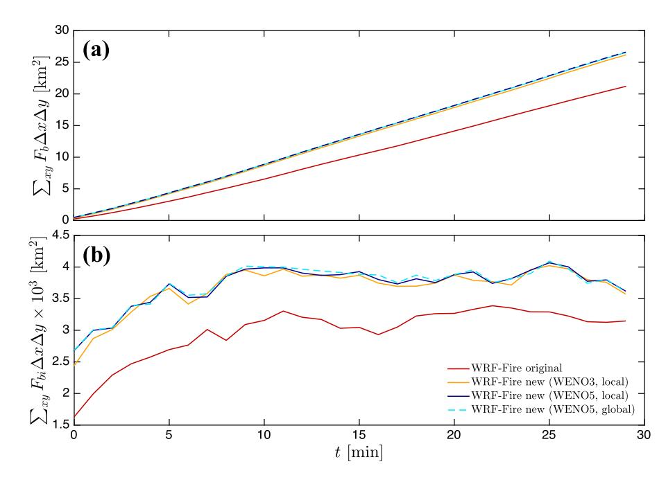

**Figure 7.** Time evolution of horizontally integrated (a) burned fuel fraction,  $\sum_{xy} F_b \Delta x \Delta y$ , and (b) instantaneous fuel burned,  $\sum_{xy} F_{bi} \Delta x \Delta y$ . Comparison of the original WRF-Fire (ENO1, no reinitialization,  $\epsilon = 0.4$ ) and the new WRF-Fire using high-order discretization in all the domain (global) and the hybrid-order method (local), solving the reinitialization equation and with  $\epsilon = 0.1$ . Turbulent CBL1 case with  $U_q = 15$  m s-1 and  $\langle w'\theta' \rangle_s = 0.015$  K m s-1.

alternating low and high horizontal wind speed regions in the spanwise direction (Figure 9a). This flow pattern is associated with the presence of convective rolls, emerging at convergence regions of low horizontal wind speed and positive vertical velocity (see contours in Figure 9b). In contrast, CBL2 case presents a more uniform fire-front shape, with variability originated from the explicit resolution of turbulent structures

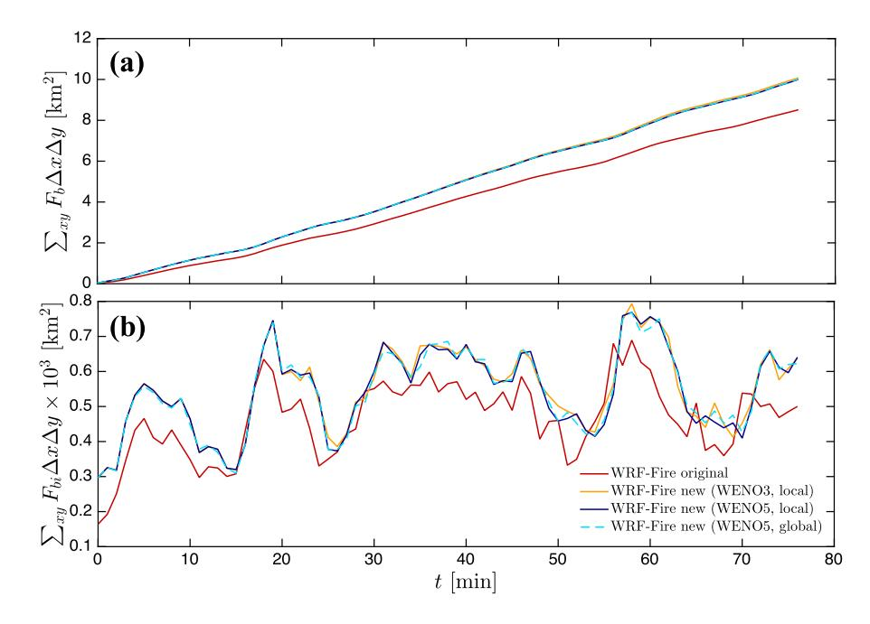

**Figure 8.** Time evolution of horizontally integrated (a) burned fuel fraction,  $\sum_{xy} F_b \Delta x \Delta y$ , and (b) instantaneous fuel burned,  $\sum_{xy} F_{bi} \Delta x \Delta y$ . Comparison of the original WRF-Fire (ENO1, no reinitialization,  $\epsilon = 0.4$ ) and the new WRF-Fire using high-order discretization in all the domain (global) and the hybrid-order method (local), solving the reinitialization equation and with  $\epsilon = 0.1$ . Turbulent CBL2 case with  $U_g = 5 \text{ m s}^{-1}$  and  $\langle w'\theta' \rangle_s = 0.050 \text{ K m s}^{-1}$ .

10.1002/2017MS001108

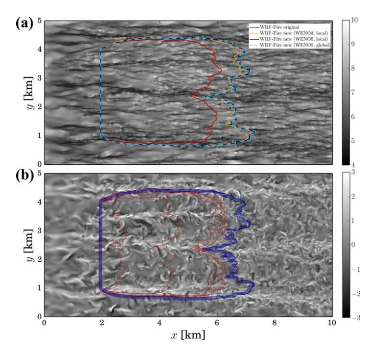

**Figure 9.** (a) Fire perimeter,  $\varphi=0$ , for the original WRF-Fire (ENO1, no reinitialization,  $\epsilon=0.4$ ) and the new WRF-Fire using global high-order discretization and the hybrid-order method (labeled as local) over filled contours of  $U_F$  (b) Isocontours of  $\varphi=[-8\Delta x:4\Delta x:8\Delta x]$  for the original WRF-Fire and the new WRF-Fire algorithm with hybrid-order discretization (reinitialization,  $\epsilon=0.1$ ) over filled contours of vertical velocity at z=100 m. Turbulent CBL1 case with  $U_g=15$  m s $^{-1}$  and  $\langle w'\theta'\rangle_s=0.015$  K m s $^{-1}$ , at t=20 min from ignition.

driving the fire-front propagation. In this case, surface wind speed field presents streamwise-alternating patches of high and low velocity, resulting from the presence of cellular convection (see Figure 10). This type of convective structures generates a pulsation in the instantaneous fuel burned over time, in comparison to the more steady distribution in the case of convective rolls (compare Figures 7b and 8b). Despite the undeprediction of fire rate of spread and consequently fire area, results from the original WRF-Fire qualitatively resemble those obtained with the new WRF-Fire implementation. We attribute this to the fact that we are considering cases where forcing conditions are stationary and therefore turbulence is homogeneous, and more importantly, there are no feedbacks from the fire to the atmosphere. Even under these favorable conditions, three-dimensional turbulent transport and dispersion of smoke, simulated as a passive tracer with the source corresponding to 2% of the fuel burned, displays large differences in the spatial distribution as seen from the example shown in Figure 11, which are of the same order of magnitude of the actual smoke concentration.

Beyond the fire area underprediction issue in the original WRF-Fire model, fire perimeter exhibits less spatial variability compared to results using the new algorithm. In order to quantify the amplitude of spatial gradients at the fire front, spectra of the spatial variability of the fire front (eastern portion of the fire perimeter) was calculated along the spanwise direction, and compared between the original and new WRF-Fire for the two turbulent CBLs in Figure 12. For the CBL1 case, both models produce similar results for wavenumbers associated with the total fire width,  $k < 10^{-3}$  m-1. However, for larger k (smaller spatial scales), the original WRF-Fire systematically underestimates the energy content due to the smoothing effects arising from

low-order discretization, lack of reinitialization and larger artificial viscosity, which makes it inherently more dissipative. In particular, it is worth remarking that the new level-set algorithm implemented in WRF-Fire is capable of resolving sharp small-scale gradients as the ones developing at the interface between the roll structure flowing through the middle of the fire front, in contrast to those considerably smeared out by the original WRF-Fire (see Figure 9a). For the CBL2 case, there is a nearly constant shift of  $\approx$ 4–6 times the energy for all the wavenumbers, with the original WRF-Fire underpredicting the amplitude of spatial variability of the fire front (see Figure 10a). Note that since we performed uncoupled simulations where the fire line does not affect the flow and therefore the driving turbulent winds bear a  $k^{-5/3}$  spectral distribution characteristic of fully developed turbulence in the inertial range of the atmospheric boundary layer, some inheritance of such properties can be expected. In general, spectral distributions are steeper than Kolmogorov's  $k^{-5/3}$ slope that the forcing turbulent flow bears, to an approximately  $k^{-3}$  distribution. Such deviation is expected due to both the spread in the normal direction of the flow and the nonlinear rate of spread from the  $\alpha_2$ exponent in equation (10). Also, it is interesting to note that there can be some flattening of the distribution at high wavenumbers due to a continuous exposure to large shear between regions of high and low horizontal wind speeds. This situation causes large gradients at the fire front, as it is the case for the CBL1 with presence of convective rolls, which are again attenuated in the WRF-Fire simulation.

#### 5. The Last Chance Wildfire

In this section, further testing and evaluation of the new WRF-Fire algorithm is performed for a real wildfire event. For that purpose, we select the Last Chance fire, which occurred in Colorado in June 2012, burned of several structures in the Last Chance city (east of Denver), and resulted in a large burned area of about 45,000 ac ( $\approx$ 182 km²) as the wildfire propagated toward Woodrow. The Last Chance fire was initiated from sparks originated from a flat tire on a passing vehicle near State Highway 71, approximately 5 km south of Last Chance. Atmospheric conditions consisted of high temperatures and low humidity that contributed to

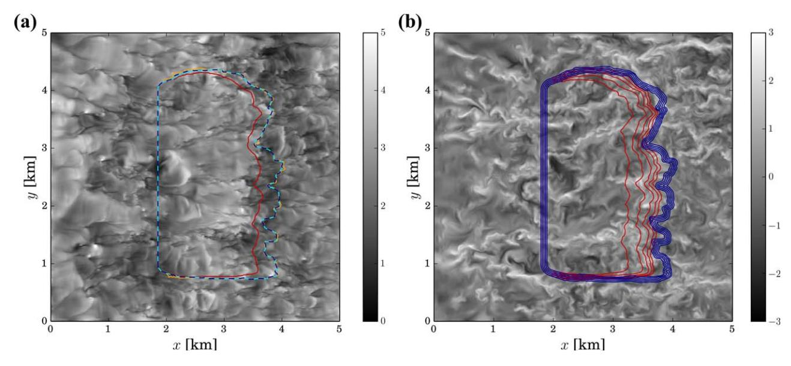

**Figure 10.** (a) Fire perimeter,  $\varphi=0$ , for the original WRF-Fire (ENO1, no reinitialization,  $\epsilon=0.4$ ) and the new WRF-Fire using global high-order discretization and the hybrid-order method (labeled as local) over filled contours of  $U_F$  (b) Isocontours of  $\varphi=[-8\Delta x:4\Delta x:8\Delta x]$  for the original WRF-Fire and the new WRF-Fire algorithm with hybrid-order discretization (reinitialization,  $\epsilon=0.1$ ) over filled contours of vertical velocity at z=100 m. Turbulent CBL2 case with  $U_g=5$  m s-1 and  $\langle w'\theta'\rangle_s=0.050$  K m s-1, at t=55 min from ignition.

partially dry the fuels, together with high synoptically driven winds, collectively leading to a rapid propagation of the fire in a relatively short period of time. Under these conditions, it is plausible to consider that the Last Chance wildfire was a weather-driven event, and therefore uncoupled fire-spread simulations are likely to provide reasonable results.

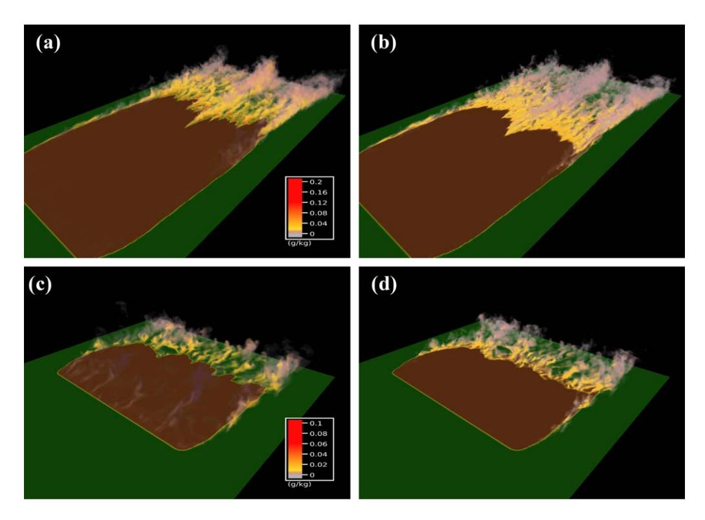

**Figure 11.** (a) Volume rendering of smoke concentration ( $g_{smoke}/kg_{air}$ ) from a source set to a 2% of the fuel burned with the new WRF-Fire, CBL1 case at t=20 min after ignition. (b) Absolute difference smoke concentration between the original and the new WRF-Fire. (c, d) Same as Figures 11a and 11b but for CBL2 case at t=55 min after ignition.

10.1002/2017MS001108

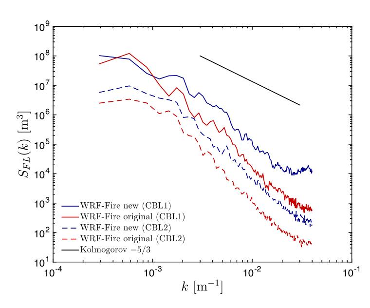

**Figure 12.** Spectra of the spatial variability of the fire front from the new WRF-Fire with hybrid-order discretization (solid lines) and the original WRF-Fire (dashed lines) for turbulent CBL1 and CBL2 cases.

For the Last Chance fire simulations, WRF was configured using three nested domains with horizontal resolutions of 9, 1, and 111 m (nesting ratio of 9), with the innermost domain containing the fire and covering an area of 26  $\times$  26 km2. To benefit from high-resolution 30 m fuel categories from LANDFIRE database without substantially increasing the computational cost of the simulations, the fire grid where the level set is solved was further refined from the atmospheric grid resolution by a factor of 4 in both horizontal directions ( $\Delta_{fire} \approx$  28 m). Bilinear interpolation of the atmospheric wind fields was performed to provide the required higher-resolution mid flame height wind speed at the fire grid. In the vertical coordinate, 45 levels were set covering from the surface to a height corresponding to 200 hPa ( $\approx$ 12 km), with vertical grid size progressively stretching with height to allow a better representation of ABL structures. The physical parameterizations used in the simulations were: WRF Single-Moment 6-class scheme for microphysics (Hong & Lim, 2006), RRTMG scheme for longwave radiation (lacono et al., 2008), Dudhia scheme for shortwave radiation (Dudhia, 1989), Noah land surface model (Chen & Dudhia, 2001), MYNN planetary boundary layer scheme (Nakanishi & Niino, 2006) (only in the 9 and 1 km domains), and a surface layer scheme based on the Monin-Obukhov similarity theory (Jiménez et al., 2012). In the 111 m resolution domain, a three-dimensional LES mixing formulation

was applied, same as in section 4. The ERA-40 reanalysis product (Uppala et al., 2005) was used to provide large-scale initial and boundary conditions every 6 h for the simulated period (25 June 1800 UTC to 26 June 0900 UTC).

The Last Chance fire ignited on 25 June, approximately at 1930 UTC (1330 LT). Figure 13 shows fire perimeters from the original and new WRF-Fire valid at t=3 h after ignition (25 June 2230 LT), together with final burned area obtained from the Monitoring Trends in Burn Severity (MTBS) project (joint initiative from the US Geological Survey and the US Forest Service, http://mtbs.gov/). The burned area resulting from the simulation using the new WRF-Fire exhibits four distinct regions, with three branches propagating beyond the road that delimits the largest of the four areas. Such behavior is due to the presence of a road, which is considered by the rate-of-spread model as a no fuel category with an associated zero spread velocity. However,

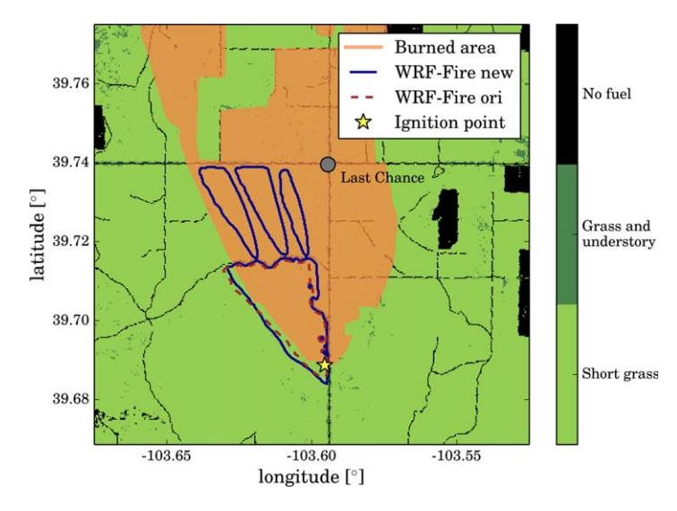

**Figure 13.** Fire perimeters from the new and original WRF-Fire after 3 h from the ignition (25 June 2230 LT), together with the final burned area from the Last Chance wildfire event. Fire perimeters are plotted over filled contours depicting the fuel type distribution used for the simulations (includes roads).

there are three gaps in that road where the level set can pass through, resulting from the categorical assignment of fuel classes to each cell and the size of the fire grid (comparable to that of the actual road). In contrast, the simulation with the original WRF-Fire level-set algorithm was unable to propagate through the breaks in no fuel of two to three grid points, unrealistically remaining contained by the road. This effect is caused by the large errors in solving the level-set equation, resulting in an overly dissipative solution that suppresses the required smallscale gradients to propagate the level set through the road gaps. At later times, fire area from the new WRF-Fire simulation stops growing after reaching the intersection between US Highway 36 (west-east) and State Highway 71 (south-north) at Last Chance. In this case, both roads conform a continuous line of no fuel points (fire break) and therefore our model cannot jump across them. In reality, spotting of sparks and/or embers transported by the strong winds occurring during the Last Chance fire created new ignitions that passed the roads, allowing the fire to continue propagating as it can be seen from the final burned area displayed in Figure 13.

Accurate representation of spotting would be required in order to have a realistic transition across fuel breaks for the Last Chance wildfire, which has not been implemented. Therefore, and knowing that

10.1002/2017MS001108

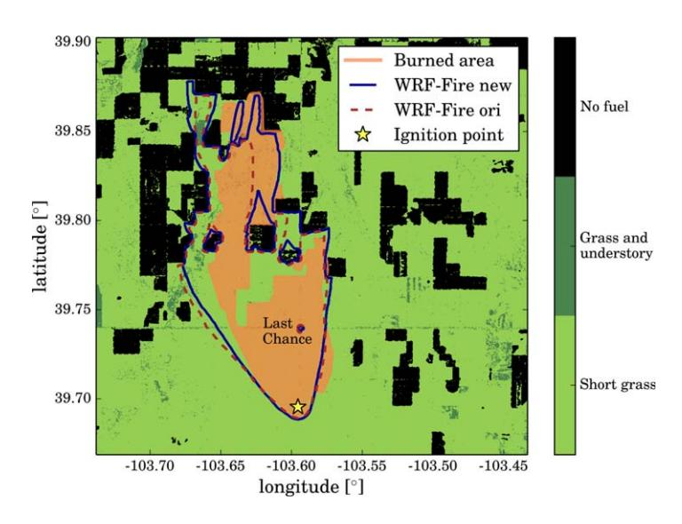

**Figure 14.** Fire perimeters from the new and original WRF-Fire after 11 h 30 min from the ignition (26 June 0700 LT), together with the final burned area from the Last Chance wildfire event. Fire perimeters are plotted over filled contours depicting the fuel type distribution used for the simulations (excludes roads)

spotting of firebrands resulted in fire propagation across roads, the simulations were repeated with a fuel distribution where roads were filtered out (see Figure 14). In addition, a more realistic ignition point was used, derived from Visible Infrared Imaging Radiometer Suite (VIIRS) satellite data at the early stages of the fire. Results from Figure 13 used an ignition point corresponding to the southern point of the observed perimeter from MTBS, which in spite of the main fire propagation direction being north, contributed to overestimate fire area in the south-west portion of the perimeter due to backward propagation into the wind direction known as backing fire. Fire perimeters at t = 11 h 30 min after ignition (26 June 0700 LT) exhibit a realistic shape compared to the burned area from MTBS observations, with the original WRF-Fire underpredicting fire spread in the north-east direction. Also, the improved level-set algorithm implemented in WRF-Fire is more efficient in laterally spreading in the regions behind no fuel clusters, where the original WRF-Fire tends to have difficulties in propagating.

While overall results for the Last Chance wildfire event can be regarded as satisfactorily accurate, some discrepancies are present when compared to the observed fire perimeter in detail. In particular, there are regions delimiting the observed fire area that are characterized by straight lines not present in our simulation. Some of these cor-

respond to roads that we eliminated but some others are fuel features not reflected in our database. Also, the model does not account for any firefighting activities and in-situ deployed fire breaks that may have shaped the perimeter evolution. These findings demonstrate the need for accurate fuel maps, which could potentially be dynamically modified on the fly when doing operational forecasting of wildfires to account for fire fighting activity such as fuel breaks and contained propagation of certain parts of the fire perimeter. In addition, although the current fire rate-of-spread formula takes into account short-range spotting, a long-range spotting model is a desired feature to improve the model performance. Nevertheless, this real case demonstrates the potential for operational wildfire models driven by high-resolution numerical weather prediction capabilities to support fire fighting activities.

#### 6. Conclusions and Discussion

Numerical aspects of the level-set method for wildland fire modeling applications were investigated in detail. For that purpose, we implemented a high-order level-set discretization including a reinitialization eguation within the wildfire physics package WRF-Fire in the Weather Research and Forecasting model and systematically analyzed the importance of the level-set implementation. Several cases of increasing complexity were considered: a uniform velocity field, two idealized convective boundary layers, and the Last Chance wildfire. It is demonstrated that the common implementation used by level-set wildfire models (i.e., first-order discretization without solving a reinitialization equation) yields to rate-of-spread errors in the range 10–35% for typical grid sizes ( $\Delta$  = 12.5–100 m) and therefore considerable fire area underestimations. Beyond underestimating the fire area, these low-order level-set implementations result in curved fire shapes in the absence of atmospheric feedbacks due to the underprediction of level-set gradients, which spuriously contributes to further augment the natural narrowing of fire area expected in wildfire-atmosphere coupled simulations of grass fires. By incorporating third-order or fifth-order WENO schemes and solving a reinitialization PDE, the new WRF-Fire algorithm results in a substantial decrease of the rate-of-spread error, and for which a grid 8 times coarser than the original WRF-Fire or WRF-SFIRE level-set implementation is necessary to achieve similar results. Moreover, we show that a reduced artificial viscosity coefficient of  $\epsilon = 0.1$  allows the new WRF-Fire level-set algorithm's errors to become nearly grid independent and lower than 1%, and still ensure numerical stability of the level-set solutions. Also, the underestimation of fire area at the sharp transition between the fire front and the lateral flanks is found to be reduced by a factor of  $\approx 7$  when compared to the original WRF-Fire or WRF-SFIRE level-set implementation.

10.1002/2017MS001108

A hybrid-order level-set method with locally reduced artificial viscosity was proposed to substantially alleviate the cost associated with high-order discretizations. With that approach, only high-order discretization is used in a band surrounding the interface, which is combined with a lower artificial viscosity for further improvement of accuracy. Typically, not more than 20–30% of the domain will be part of the high-order band (case dependent), therefore the increase in computational cost is approximately less than 10% in the case of two-dimensional level-set implementations within a three-dimensional atmospheric solver, as it is the case in wildfire models. This proposed approach was tested on two convective ABLs with explicit resolution of turbulence in LES mode ( $\Delta = 12.5$  m), with errors in the instantaneous fuel burnt compared to global high-order level-set implementations of  $\approx$ 1% and negligible differences in fire area ( $\approx$ 0.01%, two orders of magnitude smaller). On the contrary, the original WRF-Fire systematically underpredicts fire area, as well as smears out gradients in the fire front as revealed by decreased energy levels by a factor of 4–6 in the energy spectra. Also, the original WRF-Fire is not able to correctly capture sharp gradients originating in the transition from low-speed to high-speed regions. Moreover, turbulent transport and dispersion of smoke passive tracer released as the fire front propagates, reveals spatial differences in smoke concentration of the same order as the smoke concentration with the new WRF-Fire algorithm. We hypothesize that these differences would likely be further amplified when a coupled simulation is performed, since the feedbacks from the fire to the atmosphere will modify the local forcing winds, with nonlinearities in the turbulent ABL flow response continuously contributing to disparities in the solutions. In addition, real wildfire simulations of the Last Chance event evidenced additional benefits of high-order accurate level-set algorithms in propagating across narrow fuel gaps and expanding over the back side of no fuel clusters.

Herein, we focused on evaluating the influence of the level-set algorithm in uncoupled simulations, to isolate the effect of numerical implementation. The level set or any other method for tracking and propagating the fire front (e.g., tracer particles, markers) requires a local rate of spread to be prescribed at each point conforming the fire front. For the rate of spread, we used Rothermel's semiempirical model, which is the standard for parameterized rate-of-spread in coupled wildfire-atmospheric models (e.g., Clark et al., 2004; Coen et al., 2013; Filippi et al., 2009; Mandel et al., 2011). However, such parameterization was developed as a bulk fire spread, based on the undisturbed wind upstream of the fire at a given height. In the absence of atmospheric feedbacks, the use of Rothermel's model may still provide reasonable results, with the difference that it was developed as a bulk approximation for the entire fire front rather than for every point of the perimeter independently. While the accuracy of the level-set algorithm developed herein does not depend on the particular rate-of-spread formulation used, the performance of the model in coupled wildfire simulations can be improved by using a local rate-of-spread parameterization that accounts for the specific modification of the atmospheric flow at the fire front due to wildfire feedbacks.

Finally, another aspect that requires further investigation is the interaction between ABL turbulence and wildland fires. Recent numerical simulations by Canfield et al. (2014) suggest that a series of streamwise vortex pairs originated by the fire produce a regular alternating pattern of up-wash and down-wash zones, which is a dominant process in the fire dynamics and propagation. Their results were obtained in absence of resolved inflow turbulence, with the fire being driven by a mean vertical wind shear profile. However, our turbulent resolving, yet uncoupled, smoke concentration from a convective ABL simulation shown in Figure 11a demonstrates that similar type of structures such as convective rolls are already present in the near-surface region of the atmosphere. We expect the development of an accurate coupled wildfire-atmosphere model to substantially contribute to gain insight into such intricate interactions, in particular in the presence of varying weather conditions and other heterogeneities such as terrain and fuel distribution, leveraging recent multiscale modeling efforts (Muñoz-Esparza et al., 2017).

#### Acknowledgments

All the simulations were performed on the Yellowstone supercomputer at the National Center for Atmospheric Research (NCAR). Three-dimensional visualizations were created with VAPOR (Clyne et al., 2007), developed as an Open Source application by the National Center for Atmospheric Research and under the sponsorship of the National Science Foundation. The level-set algorithm described herein is publicly available in WRF version 4.0, accessible at http://www2.mmm.ucar.edu/wrf/users/download/get\_source.html.

#### References

Adalsteinsson, D., & Sethian, J. (1995). A fast level set method for propagating interfaces. *Journal of Computational Physics*, 118(2), 269–277. Albini, F. A., & Reinhardt, E. D. (1995). Modeling ignition and burning rate of large woody natural fuels. *International Journal of Wildland* 

Anderson, H. E. (1982). *Aids to determining fuel models for estimating fire behavior* (Gen. Tech. Rep. INT-122).

Bova, A. S., Mell, W. E., & Hoffman, C. M. (2016). A comparison of level set and marker methods for the simulation of wildland fire front propagation. *International Journal of Wildland Fire*, 25(2), 229–241.

Calderer, A., Kang, S., & Sotiropoulos, F. (2014). Level set immersed boundary method for coupled simulation of air/water interaction with complex floating structures. *Journal of Computational Physics*, 277, 201–227.

10.1002/2017MS001108

- Canfield, J., Linn, R., Sauer, J., Finney, M., & Forthofer, J. (2014). A numerical investigation of the interplay between fireline length, geometry, and rate of spread. *Agricultural and Forest Meteorology*, 189, 48–59.
- Chen, F., & Dudhia, J. (2001). Coupling an advanced land surface–hydrology model with the Penn State–NCAR MM5 modeling system. Part I: Model implementation and sensitivity. *Monthly Weather Review*, 129(4), 569–585.
- Cheney, N., Gould, J., & Catchpole, W. (1993). The influence of fuel, weather and fire shape variables on fire-spread in grasslands. *International Journal of Wildland Fire*, 3(1), 31–44.
- Chopp, D. L. (1993). Computing minimal surfaces via level set curvature flow. Journal of Computational Physics, 106(1), 77-91.
- Clark, T. L., Coen, J., & Latham, D. (2004). Description of a coupled atmosphere–fire model. *International Journal of Wildland Fire*, 13(1), 49–63. Clark, T. L., Jenkins, M. A., Coen, J., & Packham, D. (1996a). A coupled atmosphere–fire model: Convective feedback on fire-line dynamics.
- Clark, T. L., Jenkins, M. A., Coen, J., & Packham, D. (1996a). A coupled atmosphere–fire model: Convective feedback on fire-line dynamics Journal of Applied Meteorology, 35(6), 875–901.
- Clark, T. L., Jenkins, M. A., Coen, J., & Packham, D. R. (1996b). A coupled atmosphere-fire model: Role of the convective froude number and dynamic fingering at the fireline. *International Journal of Wildland Fire*, 6(4), 177–190.
- Clyne, J., Mininni, P., Norton, A., & Rast, M. (2007). Interactive desktop analysis of high resolution simulations: Application to turbulent plume dynamics and current sheet formation. *New Journal of Physics*, *9*(8), 301.
- Coen, J. L., Cameron, M., Michalakes, J., Patton, E. G., Riggan, P. J., & Yedinak, K. M. (2013). WRF-Fire: Coupled weather–wildland fire modeling with the Weather Research and Forecasting model. *Journal of Applied Meteorology and Climatology*, 52(1), 16–38.
- Dudhia, J. (1989). Numerical study of convection observed during the winter monsoon experiment using a mesoscale two-dimensional model. *Journal of the Atmospheric Sciences*, 46(20), 3077–3107.
- Filippi, J. B., Bosseur, F., Mari, C., Lac, C., Le Moigne, P., Cuenot, B., et al. (2009). Coupled atmosphere-wildland fire modelling. *Journal of Advances in Modeling Earth Systems*, 1, 11. https://doi.org/10.3894/JAMES.2009.1.11
- Grandey, B. S., Lee, H.-H., & Wang, C. (2016). Radiative effects of interannually varying vs. interannually invariant aerosol emissions from fires. *Atmospheric Chemistry and Physics*, 16(22), 14495–14513.
- Hong, S.-Y., & Lim, J.-O. J. (2006). The WRF single-moment 6-class microphysics scheme (WSM6). Journal of the Korean Meteorological Society. 42(2), 129–151.
- lacono, M. J., Delamere, J. S., Mlawer, E. J., Shephard, M. W., Clough, S. A., & Collins, W. D. (2008). Radiative forcing by long-lived greenhouse gases: Calculations with the aer radiative transfer models. *Journal of Geophysical Research*, 113, D13103. https://doi.org/10.1029/2008JD009944
- Jiang, G.-S., & Shu, C.-W. (1996). Efficient implementation of weighted ENO schemes. Journal of Computational Physics, 126, 202–228.
  Jiménez, P. A., Dudhia, J., González-Rouco, J. F., Navarro, J., Montávez, J. P., & García-Bustamante, E. (2012). A revised scheme for the WRF surface layer formulation. Monthly Weather Review, 140(3), 898–918.
- Lautenberger, C. (2013). Wildland fire modeling with an eulerian level set method and automated calibration. *Fire Safety Journal, 62*, 289–298. Lilly, D. K. (1966). *On the application of the eddy viscosity concept in the inertial sub-range of turbulence* (NCAR Tech. Rep. 123).
- Lilly, D. K. (1967). The representation of small scale turbulence in numerical simulation experiments. Paper presented at the IBM Scientific Computing Symposium on Environmental Sciences (pp. 195–210).
- Linn, R. R., & Cunningham, P. (2005). Numerical simulations of grass fires using a coupled atmosphere–fire model: Basic fire behavior and dependence on wind speed. *Journal of Geophysical Research*, 110, D13107. https://doi.org/10.1029/2004JD005597
- Luo, J., Hu, X., & Adams, N. (2016). Efficient formulation of scale separation for multi-scale modeling of interfacial flows. *Journal of Computational Physics*. 308. 411–420.
- Mallet, V., Keyes, D., & Fendell, F. (2009). Modeling wildland fire propagation with level set methods. Computers & Mathematics with Applications, 57(7), 1089–1101.
- Mandel, J., Beezley, J., & Kochanski, A. (2011). Coupled atmosphere-wildland fire modeling with WRF 3.3 and SFIRE 2011. *Geoscientific Model Development*, 4, 591–610.
- Mell, W., Jenkins, M. A., Gould, J., & Cheney, P. (2007). A physics-based approach to modelling grassland fires. *International Journal of Wildland Fire*. 16(1), 1–22.
- Monin, A., & Obukhov, A. (1954). Basic laws of turbulent mixing in the surface layer of the atmosphere. *Contributions of the Geophysical Institute of the Slovak Academy of Sciences USSR*. 151. 163–187.
- Motamed, M., Macdonald, C. B., & Ruuth, S. J. (2011). On the linear stability of the fifth-order WENO discretization. *Journal of Scientific Computing*, 47(2), 127–149.
- Muñoz-Esparza, D., Kosović, B., García-Sánchez, C., & van Beeck, J. (2014). Nesting turbulence in an offshore convective boundary layer using large-eddy simulations. *Boundary Layer Meteorology*, 151(3), 453–478.
- Muñoz-Esparza, D., Lundquist, J. K., Sauer, J. A., Kosović, B., & Linn, R. R. (2017). Coupled mesoscale-LES modeling of a diurnal cycle during the CWEX-13 field campaign: From weather to boundary-layer eddies. *Journal of Advances in Modeling Earth Systems*, 9, 1572–1594. https://doi.org/10.1002/2017MS000960
- Nakanishi, M., & Niino, H. (2006). An improved Mellor–Yamada level-3 model: Its numerical stability and application to a regional prediction of advection fog. *Boundary Layer Meteorology*, 119(2), 397–407.
- Osher, S., & Fedkiw, R. (2006). Level set methods and dynamic implicit surfaces (Vol. 153). Berlin, Germany: Springer Science & Business Media. Osher, S., & Sethian, J. A. (1988). Fronts propagating with curvature-dependent speed: Algorithms based on Hamilton–Jacobi formulations. Journal of Computational Physics, 79(1), 12–49.
- Paton-Walsh, C., Emmons, L. K., & Wiedinmyer, C. (2012). Australia's black saturday fires—Comparison of techniques for estimating emissions from vegetation fires. *Atmospheric Environment*, 60, 262–270.
- Peng, D., Merriman, B., Osher, S., Zhao, H., & Kang, M. (1999). A PDE-based fast local level set method. *Journal of Computational Physics*, 155(2), 410–438.
- Rehm, R. G., & McDermott, R. J. (2009). Fire-front propagation using the level set method (Tech. Rep. NIST 1611). Washington, DC: US Department of Commerce, National Institute of Standards and Technology.
- Rochoux, M. C., Ricci, S., Lucor, D., Cuenot, B., & Trouvé, A. (2014). Towards predictive data-driven simulations of wildfire spread—Part I: Reduced-cost Ensemble Kalman Filter based on a Polynomial Chaos surrogate model for parameter estimation. *Natural Hazards and Earth System Sciences*, 14(11), 2951–2973.
- Rothermel, R. C. (1972). A mathematical model for predicting fire spread in wildland fuels (USDA Forest Service Research Paper INT-115). Sethian, J. A. (1996). A fast marching level set method for monotonically advancing fronts. *Proceedings of the National Academy of Sciences of the United States of America*, 93(4), 1591–1595.
- Sullivan, A. L. (2009). Wildland surface fire spread modelling, 1990–2007. 2: Empirical and quasi-empirical models. *International Journal of Wildland Fire*, 18(4), 369–386.

10.1002/2017MS001108

- Sussman, M., Smereka, P., & Osher, S. (1994). A level set approach for computing solutions to incompressible two-phase flow. *Journal of Computational Physics*, 114(1), 146–159.
- Uppala, S. M., P., Kållberg, A., Simmons, U., Andrae, V. D., Bechtold, M., Fiorino, J., et al. (2005). The ERA-40 re-analysis. *Quarterly Journal of the Royal Meteorological Society*, 131(612), 2961–3012.
- Wang, R., & Spiteri, R. J. (2007). Linear instability of the fifth-order WENO method. SIAM Journal on Numerical Analysis, 45(5), 1871–1901. Wiedinmyer, C., Akagi, S., Yokelson, R. J., Emmons, L., Al-Saadi, J., Orlando, J., et al. (2011). The fire inventory from NCAR (FINN): A high resolution global model to estimate the emissions from open burning. Geoscientific Model Development, 4(3), 625–641.
- Xu, J.-J., Yang, Y., & Lowengrub, J. (2012). A level-set continuum method for two-phase flows with insoluble surfactant. *Journal of Computational Physics*, 231(17), 5897–5909.
- Yang, J., & Stern, F. (2009). Sharp interface immersed-boundary/level-set method for wave-body interactions. *Journal of Computational Physics*, 228(17), 6590–6616.